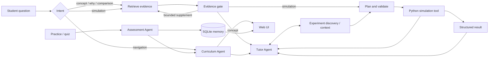

# AI Tutor for Stochastic Processes

[](https://github.com/JW35711/ai-tutor-for-stochastic-processes/actions/workflows/test.yml)
[](https://www.python.org/)
[](LICENSE)

| Course coverage | Knowledge points | Executable tools | RAG entries | Acceptance cases |
| ---: | ---: | ---: | ---: | ---: |
| 11/11 modules | 40 | 15 | 421 | 477/488 current credibility baseline (327 core + 129 hard + 32 holdout) |

An educational AI Agent prototype extending the degree project:
**Simulation and Visualization of Stochastic Mechanisms: Applications to
Engineering Course Development**.

The final thesis notebooks are mirrored here as the Agent's approved teaching
material. The repository also contains reusable simulation tools, an exercise,
tests, and a web demonstration. The thesis-only computational repository is
available at
[simulation-visualization-stochastic-processes](https://github.com/JW35711/simulation-visualization-stochastic-processes).

## Degree-project aim

The project develops computational teaching material for an introductory
course on stochastic processes. Each notebook follows a common workflow:

1. introduce a stochastic model;
2. state the simulation rule;
3. generate a sample path or realisation;
4. repeat the experiment when studying a distribution or average;
5. compare simulation with a theoretical reference value;
6. interpret the graphical output.

The notebooks supplement mathematical analysis rather than replacing it. Their
purpose is to make stochastic mechanisms visible, reproducible and easier to
explore.

## Notebook modules

| Module | Notebook | Main topic |
| --- | --- | --- |
| 0 | `00_Monte_Carlo.ipynb` | Monte Carlo simulation workflow |
| 1 | `01_Bernoulli&Poisson.ipynb` | Bernoulli and Poisson processes, waiting times |
| 2 | `02_Random_Walk_Part1.ipynb` | Discrete-time random walks and gambler's ruin |
| 3 | `03_Random_Walk_Part2.ipynb` | Continuous-time random walks |
| 4 | `04_Random_Walk_Part3.ipynb` | Brownian motion and random-walk approximation |
| 5 | `05_Markov_Chain_Part1.ipynb` | Discrete-time Markov chains and PageRank |
| 6 | `06_Markov_Chain_Part2.ipynb` | Continuous-time chains and birth-death processes |
| 7 | `07_Markov_Chain_Part3.ipynb` | Reliability, buffers and the M/M/1 queue |
| 8 | `08_Exploratory_Module_1.ipynb` | Non-homogeneous Poisson processes by thinning |
| 9 | `09_Exploratory_Module_2.ipynb` | Growing self-avoiding walks |
| 10 | `10_Exploratory_Module_3.ipynb` | Coalescing particles on a circle |

The mathematical scope covers counting processes, random-motion models,
discrete- and continuous-time Markov chains, reliability and queueing. The
three exploratory modules change one modelling assumption at a time:
time-homogeneous intensity, path independence, and a single-particle state.

## Run the thesis notebooks

Python 3.10 or newer is recommended.

```bash
python3 -m venv .venv
source .venv/bin/activate
python -m pip install --upgrade pip
pip install -r requirements.txt
jupyter lab
```

Open the notebooks in `notebooks/` and run them in numerical order. See
[REPRODUCIBILITY.md](REPRODUCIBILITY.md) for the clean-environment procedure,
random-seed policy and submission checklist.

The notebooks are also the authoritative source for the Simulation layer. The
generated `data/notebook_experiments.json` registry preserves their cell order,
teaching context, experiment-to-KP mapping and visualization targets. Rebuild
and audit it with:

```bash
python scripts/audit_notebook_visualizations.py --write
```

The audit detects 74 notebook visualization targets across Modules 00–10. The
registration audit reports four separate gates: registration, executable
engine, renderer contract, and end-to-end coverage. A target is only counted
as `E2E_IMPLEMENTED` after the real Python engine runs with safe defaults, the
structured payload passes its renderer contract, and the target is reachable
through the experiment/API mapping. Run the complete verification with:

```bash
python scripts/audit_notebook_visualizations.py
python scripts/verify_notebook_visualizations.py --update-registry
```

The current registry has 74/74 registered targets and the latest verification
report has 74/74 verified E2E visualizations. A multi-panel output is treated
as one notebook target; future unregistered plotting cells remain detectable.

Experiment routing is evaluated separately with:

```bash
python evals/run_experiment_routing_evaluation.py
```

This checks module-level selection, parameter extraction, follow-up context,
tool execution, and renderer success without changing simulation mathematics.

### Course-RAG coverage and answerability governance

The current baseline also contains three grounded benchmark cases for each of
the 40 knowledge points (120 cases). The benchmark is generated from the
backend curriculum and reviewed course source locators, so it distinguishes a
knowledge point that exists in the corpus from one that is merely mentioned by
a related passage:

```bash
python scripts/build_course_coverage_cases.py
python evals/run_course_coverage_evaluation.py --output /tmp/course_coverage.json
python scripts/audit_course_rag_coverage.py /tmp/course_rag_coverage.json
python evals/run_course_coverage_ab.py --output /tmp/course_coverage_ab.json
# Credibility checkpoint: structured 120-case set plus natural/hard questions
python scripts/build_course_hard_cases.py
python evals/run_rag_credibility_evaluation.py \
  --output artifacts/rag_credibility_report.json \
  --markdown artifacts/rag_credibility_report.md
python evals/run_holdout_evaluation.py --output /tmp/course_holdout.json
```

Retrieval uses deterministic hybrid scoring and a data-driven alias file
(`data/retrieval_aliases.json`). Notebook-to-knowledge-point mapping records
`high`, `ambiguous`, or `unmapped` confidence. A routed concept may add a
bounded amount of same-notebook or same-page parent/neighbor context; it never
replaces the scored evidence. Missing claim requirements trigger at most two
bounded supplementary retrieval rounds.

Answerability is a deterministic evidence-coverage gate. It distinguishes
`SUPPORTED`, `PARTIAL`, `CONFLICT`, `NONE`, and `OUT_OF_SCOPE`; relevance alone
does not make a claim answerable. Conflict handling currently covers explicit
contradictory claims. Implicit contradiction and full entailment remain future
work. A future optional hybrid design could keep the deterministic gate first
and call a semantic or LLM entailment judge only for ambiguous, low-confidence
cases; it is not required for the current baseline.

The credibility checkpoint keeps the reviewed 120-case structured set, a
129-case natural/hard set covering all 40 knowledge points, and a separate
32-question holdout authored independently from the development set. It reports true
Hit@1, Hit@3 and MRR separately for ORACLE ROUTING (gold module/concept supplied
for retrieval measurement) and REAL ROUTING (student question only). It also
reports answer success, false abstention, unsupported answers, evidence
sufficiency, bounded supplementary retrieval, deterministic failure stages and
observational A/B results for unscoped retrieval and the existing reranker.
The hard set is a credibility diagnostic, not a claim of a general benchmark;
its cases and the corpus SHA are versioned in the current manifest. The
deterministic reranker remains evaluation-only: after routing fixes it improved
hard-set Hit@3 from 0.9134 to 0.9370 with about 0.4 ms mean retrieval overhead,
but it is not enabled in production until a repeated holdout/structured A/B
shows the same benefit without a regression.

## AI teaching-agent extension

The current system is a responsibility-bounded three-agent educational system
with conditional LangGraph workflow branches. It turns all eleven thesis modules into a curriculum-backed learning experience and
keeps the 15 numerical tools behind explicit simulation requests:

- Monte Carlo estimation;
- Bernoulli and homogeneous Poisson processes;
- one-dimensional random walks;
- continuous-time random walks;
- standard Brownian motion;
- finite-state Markov chains;
- continuous-time Markov chains and finite birth-death processes;
- reliability systems, discrete buffers and M/M/1 queues;
- nonhomogeneous Poisson processes by thinning;
- growing self-avoiding walks;
- coalescing particles on a circle.

The Curriculum Agent decides what to study next from the backend-owned
curriculum, prerequisites and learner state. The Assessment Agent scores
practice/quiz evidence and flags review needs. The Tutor Agent decides how to
teach. For a concept, why, comparison, derivation, example or hint question, it retrieves
curated Notebook/textbook evidence and produces a grounded tutor answer. Only
an explicit simulation request continues through planning, validation and one
of the 15 Python tools. SQLite learner memory persists simulation and
concept-check results across server restarts. A transparent recommendation
policy uses coverage, practice evidence and quiz exposure without claiming to
measure ability. Every response carries a deterministic `run_sha256` for
verified simulations and a separate request ID for log correlation.



The orchestration is an official LangGraph `StateGraph` with conditional edges.
Its behavior is:

```text
START → route
route → Curriculum Agent → navigation → Tutor Agent
route → concept / why / comparison → retrieve → evidence gate → Tutor Agent
route → simulation → retrieve → evidence gate → plan → Python tool → Tutor Agent
route → Assessment Agent → SQLite learner memory → Curriculum Agent → Tutor Agent
route → out_of_scope → Tutor Agent safe scope response
```

The evidence gate can take at most two supplementary retrieval rounds before
the existing answerability policy responds. A normal concept question skips
Curriculum and Assessment to avoid unnecessary work; quiz feedback uses the
explicit Assessment → Curriculum → Tutor handoff. These are three bounded
responsibility agents, not open-ended autonomous planners.

The Experiment Registry (`data/notebook_experiments.json`) is the source of
truth for notebook-derived experiments. Theory questions may recommend one or
two registry entries without running them. An explicit request, a `Show me`
handoff, or a declared parameter change selects the same registry entry and
passes only its declared parameters to the matching Python engine. The service
stores only compact active experiment context (identifier, parameters and a
verified summary), never raw arrays, so follow-ups such as `Set lambda to 4`
and `What changed?` remain in context. Unsupported parameters are rejected.

Numerical computation is performed by Python, not by the language model. The
optional DeepSeek/OpenAI-compatible model synthesizes concept explanations
from the original question and retrieved evidence. It is never used to create
or modify simulation numbers. If the provider is unavailable, the same
question-aware answer path returns a concise grounded fallback.

### KP-level personalization

The adaptive loop is deterministic and evidence-driven:

```text
Practice / Quiz → Assessment Agent → KP mastery in SQLite
→ prerequisite-aware Curriculum Agent → Tutor teaching mode → next action
```

Only submitted practice and quiz answers update a knowledge point. Reading,
concept chat, navigation and simulations do not count as mastery evidence.
The status is a product heuristic, not a grade, probability of knowing or
psychological measurement. Decisions use `NOT_STARTED`, `LEARNING`,
`NEEDS_REVIEW` and `MASTERED` KP records and return stable action IDs such as
`LEARN`, `PRACTICE`, `REVIEW`, `REVIEW_PREREQUISITE`, `QUIZ` and `ADVANCE`.
An unassessed prerequisite is never labelled weak. Explicit course questions
remain answerable even when prerequisites have not been assessed.

Practice uses deterministic keyword/relation checks and reports the
`grading_method`; uncertain free-text answers go to review rather than being
treated as semantic grading. Hints are three bounded course-backed levels and
are persisted as learning events. Tutor modes are `FOUNDATION`, `DEVELOPING`,
`REVIEW` and `ADVANCED`; they adapt explanation structure, not evidence or
mathematical truth.

### Run the Agent

The Agent core and web demo use the pinned dependencies in `requirements.txt`,
including the official LangGraph runtime:

```bash
python3 server.py
```

Open [http://127.0.0.1:8000](http://127.0.0.1:8000), then try:

The machine-readable API contract is available at
[http://127.0.0.1:8000/openapi.json](http://127.0.0.1:8000/openapi.json).

- `模拟强度为2、时长为5的泊松过程，使用200条路径`
- `用500条路径模拟100步随机游走，并比较理论均值`
- `用500条路径模拟T为1、网格数为200的布朗运动，解释终点方差`
- `模拟500步马尔可夫链并比较平稳分布`
- `连续时间马尔可夫链：故障率为0.25、修复率为0.15、时长为200`
- `模拟出生死亡过程：出生率为0.35、死亡率为0.3、容量为6、时长为500`
- `M/M/1 queue：到达率为0.75、服务率为1、时长为2000`
- `非齐次泊松过程 thinning：基础强度为2、峰值增量为6、高峰时刻为13`
- `自避免游走：最大步数为1000、实验次数为500`
- `圆上粒子合并：圆周大小为12、粒子数为9、实验次数为200`
- `用10000个样本做蒙特卡洛实验估计π`

To enable an OpenAI-compatible model:

```bash
export LLM_API_KEY="your-key"
export LLM_MODEL="your-model"
export LLM_BASE_URL="https://your-provider.example/v1"
python3 server.py
```

The application remains usable in offline-safe mode when these variables are
unset. The current client supports DeepSeek and other OpenAI-compatible
providers, with validated URLs, explicit timeouts, bounded exponential retries
for transient failures, and a circuit breaker. Concept answers use the original
student question as the primary instruction and synthesize retrieved evidence;
provider failures return a concise grounded fallback. Simulation numbers remain
owned by Python tools and are never rewritten by the model. Configure bounds in
`.env.example`, including `LLM_TIMEOUT`, `LLM_MAX_RETRIES`,
`ANSWER_MAX_WORDS` and `EVIDENCE_MAX_CHARS`.

Retrieval also works without a key. By default it combines IDF-weighted sparse
matching with a deterministic 384-dimensional local hashing vector. To use a
neural OpenAI-compatible embedding endpoint instead:

```bash
export RAG_EMBEDDING_BACKEND="openai_compatible"
export EMBEDDING_API_KEY="your-key"
export EMBEDDING_MODEL="your-embedding-model"
export EMBEDDING_BASE_URL="https://your-provider.example/v1"
export EMBEDDING_BATCH_SIZE="64"
python3 server.py
```

If configuration or initial indexing fails, startup records the reason and
safely falls back to the local vector backend. Hosted indexing is split into
bounded batches, and every response is checked for row order and vector
dimension before it enters the index. Embedding responses also have a
configurable size limit before JSON decoding.
If only a later query-vector request fails, the retriever safely uses sparse
scores and exposes `retrieval_mode=sparse_fallback` in sources and workflow
trace rather than claiming a hybrid result. A bounded circuit breaker then
skips repeated provider calls for 60 seconds by default, probes recovery after
the cooldown, and never caches the temporary sparse fallback as a hybrid hit.
Set `RAG_EMBEDDING_FAILURE_COOLDOWN_SECONDS` between 0 and 3600 to tune it.

Repeated retrievals use a thread-safe in-process LRU cache (256 entries by
default). `/health` reports its capacity, size, hits and misses. Set
`RAG_RETRIEVAL_CACHE_SIZE=0` to disable it during backend comparisons.

The ordered knowledge cards, Notebook cell text, reviewed lecture-note chunks
and source locators are hashed into one SHA-256 corpus version. Health,
retrieved evidence and the Dashboard expose that version so a response can be
tied to an exact teaching corpus. The local PDF files stay out of Git; only
short reviewed chunks with page locators such as
`reference/lectnotes_technmath.pdf#page-69` are indexed.

The Agent also supports contextual follow-ups. After a full request such as
`M/M/1 queue：到达率为0.75、服务率为1、时长为300`, the learner can simply say
`再把到达率改成0.8`; the module, queue tool and unchanged parameters are read
from persistent session history, while the trace lists every inherited field.

The **当前模块概念测验** button adds a graded concept check for each of the 11
modules. Simulation practice, quiz accuracy and diagnosed misconceptions are
shown separately in the learner profile; the UI does not claim that tool use
alone proves mastery. The next-practice recommendation also includes a small
spaced-repetition-style review interval derived from the local evidence score.

### Run with Docker

The Agent server itself uses only the Python standard library:

```bash
docker build -t stochastic-tutor-agent .
docker run --rm -p 8000:8000 \
  -v stochastic-tutor-data:/app/artifacts \
  stochastic-tutor-agent
```

The container runs as an unprivileged user, persists SQLite learner state in a
named volume and includes a `/ready` probe. Run `docker compose up --build` for
the read-only, resource-bounded local profile. See
[Deployment](docs/DEPLOYMENT.md) for configuration and production boundaries.

### Agent API and tests

```bash
curl http://127.0.0.1:8000/health

curl -X POST http://127.0.0.1:8000/api/chat \
  -H "Content-Type: application/json" \
  -d '{"question":"模拟100步随机游走，并比较理论均值"}'

LLM_API_KEY= LLM_MODEL= LLM_BASE_URL=https://api.openai.com/v1 python3 -m pytest -q
python3 -m unittest discover -s tests -v
python3 evals/run_evaluation.py
python3 evals/run_retrieval_evaluation.py
python3 evals/run_pedagogy_evaluation.py
python3 evals/run_safety_evaluation.py
python3 evals/run_latency_benchmark.py --repetitions 2
python3 evals/run_v1_acceptance.py
python3 evals/run_answerability_evaluation.py
# Optional real-provider run; reads local ignored .env and writes no credentials.
python3 evals/run_v1_acceptance.py --real --output /tmp/v1_acceptance_real.json
```

The deterministic regression suites contain 30 single-turn cases, 5
multi-turn conversations, 44 module-scoped retrieval cases, 10 pedagogy cases
and 20 safety cases. The current local-hash baseline is `Hit@3 = 1.0000` and
`MRR = 0.9394` on the retrieval set. The separate v1 acceptance file contains
22 unseen questions spanning definitions, explanations, derivations,
comparisons, examples, hints, navigation, simulations and scope boundaries;
the offline mock baseline is 22/22. The report preserves each case's routing,
tool decision, answer and source locators. These figures describe this
repository's small regression sets, not a general benchmark of tutoring
quality.

The current answerability gate uses deterministic evidence-coverage rules and
bounded supplementary retrieval. It checks whether retrieved evidence is
sufficient for the requested stochastic-process claim, distinguishes
`SUPPORTED`, `PARTIAL`, `CONFLICT`, `NONE` and `OUT_OF_SCOPE`, and records
supplementary retrieval rounds. Its metrics include answerability accuracy,
unsupported-answer rate, abstention precision, supplementary-retrieval success
and conflict-detection accuracy. Conflict detection currently handles explicit
contradictory claims; complex implicit contradiction and entailment are future
work. A future optional hybrid design can keep the deterministic gate first and
invoke a semantic/LLM entailment judge only for ambiguous low-confidence cases.

`data/evaluation_manifest.json` is the checked current baseline (version 4) and
now totals 488 cases: the existing 327 deterministic governance cases plus 129
natural/hard credibility cases and 32 independent holdout cases. The previous
116-case baseline and 109-case v1.0.0 result are preserved in
`data/evaluation_manifest_v1.0.0.json` and is not presented as current. A unit
test ties every displayed suite count to its versioned case file, while CI
reruns all suites before a release can pass. Each CI run also retains the JSON
evaluation reports as downloadable artifacts for 14 days.
The manifest stores the evaluated corpus SHA; the Dashboard replaces its score
with `STALE` if the running knowledge index no longer matches that version.

The test suite checks reproducibility, theoretical agreement, transition-matrix
validation, stability conditions, exploratory-model invariants, topic routing,
tool execution, citations, persistent memory, misconception diagnosis and
assessment grading. The 30-case acceptance set measures module routing, tool
choice, module-scoped evidence and workflow traces in Chinese and English. A
second five-conversation suite verifies module, tool and parameter inheritance
across server-backed follow-up turns. The optional real-provider v1 command
writes only question metadata, latency, answers and source locators to the
selected report path; credentials are read from the ignored local `.env` and
are never persisted.

Additional endpoints:

| Endpoint | Purpose |
| --- | --- |
| `GET /live` | Process liveness only |
| `GET /ready` | SQLite, catalog, knowledge and content-version readiness |
| `GET /health` | Tool, module, workflow, memory and knowledge-index status |
| `GET /openapi.json` | OpenAPI 3.1 machine-readable contract |
| `GET /api/topics` | Public catalogue for Modules 00–10 |
| `GET /api/tools` | 15 tool descriptions and JSON-ready parameter contracts |
| `POST /api/chat` | Full retrieval and simulation Agent turn |
| `GET /api/profile?session_id=...` | Persistent learner profile and history |
| `GET /api/quiz?module_id=module04` | Concept check without leaking the answer |
| `POST /api/quiz/submit` | Grade and persist an answer |
| `GET /api/sessions/{id}/export` | Export all retained learner data and provenance |
| `DELETE /api/sessions/{id}` | Reset one learner session |

Every response includes `X-Request-ID`, `X-API-Version` and basic browser
security headers. API endpoints use a per-process sliding-window limit
(60 requests per client per minute by default), and request completion is
written as one privacy-conscious JSON log event without the learner's question
text. Configure `API_RATE_LIMIT_PER_MINUTE` and `MAX_QUESTION_CHARS` through
environment variables. See [API contract](docs/API.md) for request and error
examples.

## Repository structure

```text
.
├── data/                   # Curated source-aware cards and reference chunks
├── docs/                   # Architecture and interview demo script
├── evals/                  # Routing, retrieval and pedagogy evaluations
├── exercises/              # Additional exercises
├── figures/                # Selected thesis figures
├── notebooks/              # Modules 0–10; authoritative teaching sequence
├── data/notebook_experiments.json # Notebook experiment/visualization registry
├── src/
│   ├── agent.py            # Agent orchestration
│   ├── knowledge.py        # Retrieval and source metadata
│   ├── memory.py           # Persistent SQLite learner profile
│   ├── pedagogy.py         # Transparent misconception diagnosis
│   ├── assessment.py       # Module concept checks
│   ├── agents/
│   │   ├── contracts.py    # Typed agent handoff structures
│   │   ├── curriculum.py   # What to study next
│   │   ├── assessment.py   # What the learner knows
│   │   └── tutor.py        # How to teach
│   ├── graph/
│   │   ├── state.py        # Typed LangGraph TutorState
│   │   └── workflow.py     # Official StateGraph and conditional edges
│   ├── workflow.py         # Backwards-compatible domain AgentState
│   ├── embeddings.py       # Local and optional hosted vector backends
│   ├── runtime.py          # Rate limiting, metrics and JSON events
│   ├── openapi.py          # Machine-readable API contract
│   ├── version.py          # Application and API versions
│   ├── evaluation_manifest.py # Checked dashboard evaluation summary
│   ├── tool_catalog.py      # Executable tool parameter contracts
│   ├── recommendation.py   # Explainable next-practice policy
│   ├── llm.py              # Optional compatible LLM client
│   └── processes/          # Reusable simulation engines (15 tools)
├── scripts/audit_notebook_visualizations.py # Registry coverage audit
├── tests/                  # Numerical and Agent tests
├── web/                    # Interview-demo interface
├── REPRODUCIBILITY.md
└── server.py
```

The local `reference/` directory is intentionally excluded from version
control. It contains third-party course and reference material rather than
project deliverables.

## Reproducibility policy

The teaching notebooks do not fix a random seed during normal execution, so a
rerun produces another valid realisation. Reproducibility means using the same
model, parameters and procedure and obtaining the same statistical behaviour,
not identical values. Simulation outputs should be interpreted together with
their theoretical reference values.

See [Architecture](docs/ARCHITECTURE.md) for component boundaries and
[Five-minute interview demo](docs/INTERVIEW_DEMO.md) for a concise walkthrough.
Deployment notes are in [Deployment](docs/DEPLOYMENT.md).
[Responsible AI boundaries](docs/RESPONSIBLE_AI.md) describe intended use,
learner-data handling, prompt-injection controls and evaluation limits.
For Chinese interviews, use the prepared
[project Q&A script](docs/INTERVIEW_QA_CN.md).

## Current Agent limitations

- The default vector backend is a transparent local hashing model, not a neural
  semantic embedding; an OpenAI-compatible neural backend is optional.
- Offline topic routing uses deterministic rules.
- The misconception detector is an interpretable seed rule set rather than a
  trained student model.
- The practice-evidence score is not a psychometrically validated mastery score.
- The lightweight web chart does not replace the notebook's Matplotlib figures.

Future work may add a learned reranker, a larger calibrated assessment bank,
authentication and hosted deployment. LangGraph is now the orchestration
runtime; true Multi-Agent coordination remains outside the current scope.

## License

MIT
