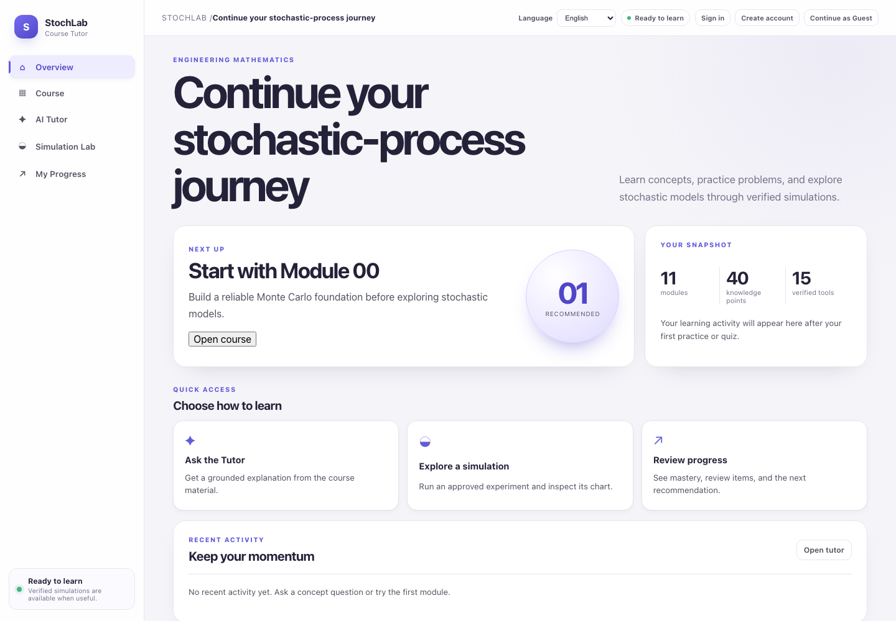
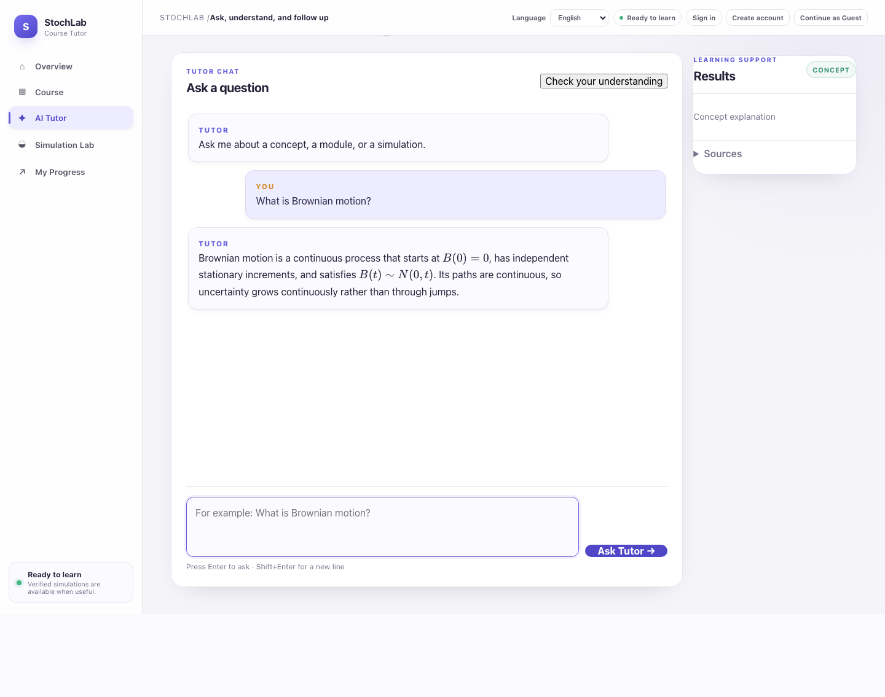
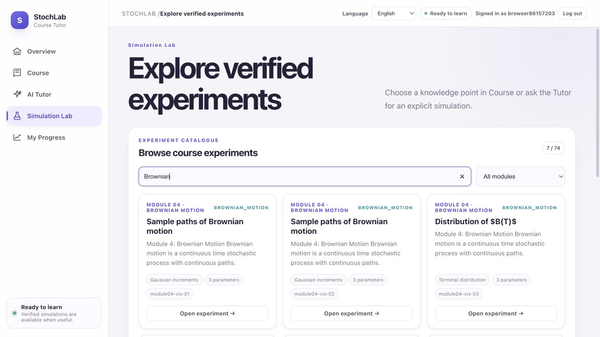
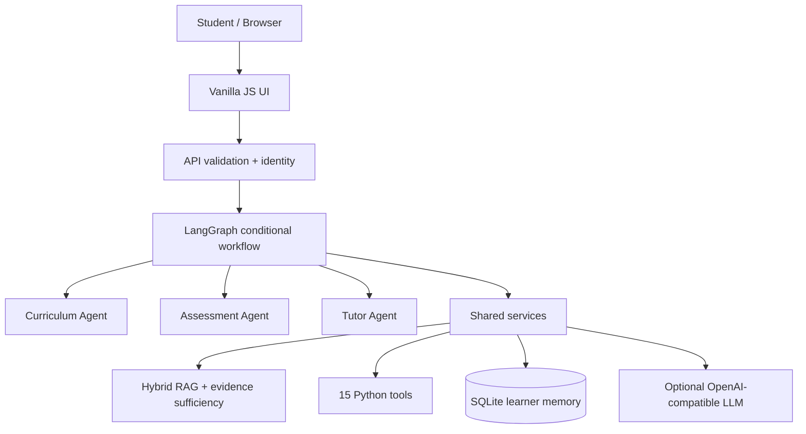

# 🎓 StochLab

### An adaptive AI Tutor for *Introduction to Stochastic Processes with Applications*

[English](README.md) · [简体中文](README.zh-CN.md) · [Svenska](README.sv.md)

[](https://github.com/JW35711/ai-tutor-for-stochastic-processes/actions/workflows/test.yml)
[](https://www.python.org/)
[](LICENSE)
[](web/index.html)

StochLab turns structured stochastic-process teaching material, Jupyter
notebooks and Python experiments into a guided learning product. It uses a
bounded three-agent teaching architecture coordinated by LangGraph: RAG
supplies course evidence, an answerability gate checks whether that evidence
supports the requested claim, Python tools own numerical truth, and assessed
knowledge-point evidence drives the next learning action.







## Why I built this

The starting point was a real stochastic-process teaching-material project.
The mathematical content was already there; the missing piece was a guided
learning experience. A learner still needs to know where to start, which
concept a question refers to, whether the available material is sufficient,
when a simulation will help, what its parameters mean, and what to study next.

StochLab therefore asks a concrete engineering question: how can an LLM help
teach mathematics without owning mathematical truth or learner-state
decisions? The separation is explicit: LLM for language and pedagogical
synthesis, RAG for course evidence, Python for numerical results, Assessment
for learning evidence, SQLite for persistent state, Curriculum for next
actions, and LangGraph for sequencing.

The repository describes a technical prototype and does not claim official
deployment or institutional endorsement.
It is not a free-form multi-agent platform.

## Try these flows

- **Learn:** `What is the Markov property?` → a concise course-grounded
  explanation and a quick check.
- **Explore:** `Simulate Brownian motion with 100 steps.` → a registered Python
  experiment, verified values and a visualization.
- **Follow up:** `Show me.` or `Set lambda to 4.` → the active experiment and
  only the relevant parameters are inherited.
- **Practice:** answer a knowledge-point question, request a hint, retry, and
  inspect assessed feedback and the next recommendation.

## What makes this different

- **Relevance is not answerability.** Retrieval can supplement, clarify,
  abstain or surface explicit conflict instead of forcing a conclusion.
- **The LLM is not a calculator.** Registered Python tools own parameters and
  numerical output.
- **Conversation is not mastery.** Only submitted practice and quiz evidence
  changes KP practice evidence.
- **Three bounded Agents, explicit handoffs.** Curriculum, Assessment and
  Tutor are coordinated by LangGraph; RAG, memory, tools and auth are services.
  SQLite and Python tools are services, not Agents.
- **Personalization is not prompt history.** Persistent KP evidence and
  prerequisite-aware decisions select the next action.
- **Browser behavior is tested.** Deterministic suites are complemented by
  real Chromium acceptance tests.

## At a glance

| Curriculum | Knowledge points | Python tools | RAG entries | Visualization targets | Browser E2E |
| ---: | ---: | ---: | ---: | ---: | ---: |
| 11 modules | 40 | 15 | 421 | 74 | 11 real cases |

## Architecture



The request branches are conditional rather than a single `RAG → LLM` call:

```text
concept → retrieve → evidence → (bounded supplement) → Tutor
simulation → retrieve → evidence → plan → Python → diagnose → Tutor
practice / quiz → Assessment → assessed KP evidence → Curriculum → Tutor
navigation → Curriculum → catalogue response
social / general → conversational response (no sources or mastery mutation)
```

The detailed runtime state contract, node conditions, three Agent handoffs,
answerability loop, response envelope and observability fields are in
[`docs/ARCHITECTURE.md`](docs/ARCHITECTURE.md). The screenshots above are from
the current local build: independent application views, a chat-first Tutor,
and a full-width verified experiment catalogue.

## From notebooks to an adaptive tutor

1. Course material and Python simulations made stochastic mechanisms visible.
2. A structured curriculum and experiment registry added stable module, KP,
   experiment and visualization IDs.
3. Hybrid RAG and answerability separated relevant evidence from sufficient
   evidence.
4. LangGraph made the three bounded Agent handoffs explicit.
5. Assessment evidence, KP recommendations, auth, multilingual UI, Docker/CI
   and Chromium tests turned the material into a usable learning product.

## Key engineering decisions

- Course answers use the original question plus bounded evidence; module
  summaries are navigation context, not substitutes for an answer.
- Evidence status can be `SUPPORTED`, `PARTIAL`, `CONFLICT`, `NONE` or
  `OUT_OF_SCOPE`. Explicit conflict is reported rather than silently resolved.
- Simulation numbers never go through an LLM rewrite. The Tutor explains the
  immutable Python result and its provenance.
- Mastery is labelled *practice evidence*. Reading, navigation, normal chat,
  hints alone and simulation runs do not update it.
- Accounts are portfolio-scale: register/login/logout, an HttpOnly session and
  per-user state isolation, without OAuth, password recovery or teacher admin.

## Technology

**Python · LangGraph · DeepSeek/OpenAI-compatible provider · hybrid sparse/dense
RAG · SQLite · NumPy · SciPy · Matplotlib · structured renderers · Vanilla
JavaScript/HTML/CSS · KaTeX · unittest · pytest · Playwright · Docker · GitHub
Actions**

## Evaluation

The current corpus fingerprint and reproduction commands are recorded in
[`docs/VERIFIED_METRICS.md`](docs/VERIFIED_METRICS.md). The current snapshot
contains:

- core single-turn **30/30** and multi-turn **5/5**;
- structured 40-KP coverage **120/120**;
- answerability/bad-path **7/7**;
- experiment routing **17/17** and visualization targets **74/74**;
- multilingual offline **43/43** and personalization **33/33**;
- real Chromium browser acceptance **11/11**;
- credibility hard-set diagnostic **99/129** and independent holdout
  **15/32** end-to-end (**21/32** routing-pass in the manifest).

The current generated manifest is **447/488**. Hard-set and holdout values are
deliberately difficult diagnostics, not a general retrieval-quality score. The
corpus SHA and the current runtime test count are maintained in
`docs/VERIFIED_METRICS.md`.

## Quick start

```bash
git clone https://github.com/JW35711/ai-tutor-for-stochastic-processes.git
cd ai-tutor-for-stochastic-processes
python3 -m venv .venv
source .venv/bin/activate
python -m pip install -r requirements.txt
cp .env.example .env
python server.py --host 127.0.0.1 --port 8000
```

Open <http://127.0.0.1:8000>. `LLM_API_KEY` is optional for a local demo; the
bounded English/Chinese/Swedish fallback remains available without a provider.
Never commit `.env` or real credentials.

Browser gate:

```bash
python -m pip install -r requirements-e2e.txt
python -m playwright install chromium
python -m pytest e2e -q
```

Runtime gate:

```bash
python -m unittest discover -s tests -v
```

## For recruiters and interviewers

- **1 minute:** read the motivation and system diagram above.
- **5 minutes:** follow the request branches in
  [`docs/ARCHITECTURE.md`](docs/ARCHITECTURE.md).
- **Technical deep dive:** inspect [`docs/API.md`](docs/API.md),
  [`docs/DEPLOYMENT.md`](docs/DEPLOYMENT.md) and the exact values in
  [`docs/VERIFIED_METRICS.md`](docs/VERIFIED_METRICS.md).
- **Responsible deployment:** see [`docs/RESPONSIBLE_AI.md`](docs/RESPONSIBLE_AI.md).

## Current limitations

The corpus is specific to one introductory stochastic-process course, and
difficult unseen wording can still expose routing gaps. Free-text grading uses
deterministic keyword/relation checks; mastery is a transparent heuristic, not
a psychometric model. Explicit contradiction detection is stronger than
implicit semantic conflict detection. SQLite and the minimal auth layer are
single-node portfolio scope. Classroom learning effectiveness has not been
experimentally validated, and KaTeX/provider quality depends on browser and
endpoint configuration.

## License

MIT. See [LICENSE](LICENSE) and [THIRD_PARTY_NOTICES.md](THIRD_PARTY_NOTICES.md).

## Lightweight domain-specific Agent Harness

The current runtime includes a small StochLab-specific Harness around the
existing LangGraph graph. It is an execution-policy boundary, not a generic
autonomous-agent framework: the product still has exactly three bounded
Agents (Curriculum, Assessment and Tutor), while RAG, answerability, Python
tools, SQLite and the LLM provider remain inspectable services.

```text
HTTP request
   │
   ▼
Harness: request id → bounded context snapshot (no raw arrays/secrets)
   │
   ▼
LangGraph: conditional route and handoffs
   ├─ navigation ───────────────► Curriculum → catalogue response
   ├─ concept/why/comparison ───► RAG → evidence gate → Tutor
   ├─ simulation ───────────────► RAG → plan → allow-listed Python tool
   │                                  → verification → Tutor
   └─ practice/quiz ────────────► Assessment → Curriculum → Tutor
   │
   ▼
Harness: existing provenance/numeric checks + safe fallback + debug telemetry
```

The Harness compacts context deterministically with the priority
**active experiment and validated parameters → module/concept → assessed
learner state → recent relevant turns → older evidence references**. It never
uses a tokenizer or an LLM to summarize, and it does not store full prompts,
raw chat history, simulation arrays or secrets. Registered simulation tools are
the only executable tools; there is no shell or arbitrary code executor.

Why a Harness? It gives every execution one request identifier, bounded context
policy, conservative post-run verification, failure categories and latency-safe
observability without moving routing, retrieval, calculation, grading or
recommendation into another abstraction. Provider retries and the existing
circuit breaker remain in `src/llm.py`.
