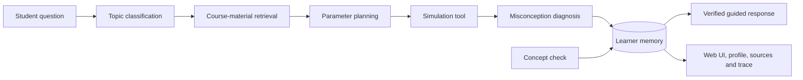

# AI Tutor for Stochastic Processes

[](https://github.com/JW35711/ai-tutor-for-stochastic-processes/actions/workflows/test.yml)
[](https://www.python.org/)
[](LICENSE)

| Course coverage | Executable tools | State nodes | RAG evidence | Acceptance cases |
| ---: | ---: | ---: | ---: | ---: |
| 11/11 modules | 15 | 7 | 236 | 67/67 |

An educational AI Agent prototype extending the degree project:
**Simulation and Visualization of Stochastic Mechanisms: Applications to
Engineering Course Development**.

The final thesis notebooks are mirrored here as the Agent's approved teaching
material. The repository also contains reusable simulation tools, an exercise,
tests, and a web demonstration. The thesis-only computational repository is
available at
[simulation-visualization-stochastic-processes](https://github.com/JW35711/simulation-visualization-stochastic-processes).

## Degree-project aim

The project develops computational teaching material for an introductory
course on stochastic processes. Each notebook follows a common workflow:

1. introduce a stochastic model;
2. state the simulation rule;
3. generate a sample path or realisation;
4. repeat the experiment when studying a distribution or average;
5. compare simulation with a theoretical reference value;
6. interpret the graphical output.

The notebooks supplement mathematical analysis rather than replacing it. Their
purpose is to make stochastic mechanisms visible, reproducible and easier to
explore.

## Notebook modules

| Module | Notebook | Main topic |
| --- | --- | --- |
| 0 | `00_Monte_Carlo.ipynb` | Monte Carlo simulation workflow |
| 1 | `01_Bernoulli&Poisson.ipynb` | Bernoulli and Poisson processes, waiting times |
| 2 | `02_Random_Walk_Part1.ipynb` | Discrete-time random walks and gambler's ruin |
| 3 | `03_Random_Walk_Part2.ipynb` | Continuous-time random walks |
| 4 | `04_Random_Walk_Part3.ipynb` | Brownian motion and random-walk approximation |
| 5 | `05_Markov_Chain_Part1.ipynb` | Discrete-time Markov chains and PageRank |
| 6 | `06_Markov_Chain_Part2.ipynb` | Continuous-time chains and birth-death processes |
| 7 | `07_Markov_Chain_Part3.ipynb` | Reliability, buffers and the M/M/1 queue |
| 8 | `08_Exploratory_Module_1.ipynb` | Non-homogeneous Poisson processes by thinning |
| 9 | `09_Exploratory_Module_2.ipynb` | Growing self-avoiding walks |
| 10 | `10_Exploratory_Module_3.ipynb` | Coalescing particles on a circle |

The mathematical scope covers counting processes, random-motion models,
discrete- and continuous-time Markov chains, reliability and queueing. The
three exploratory modules change one modelling assumption at a time:
time-homogeneous intensity, path independence, and a single-particle state.

## Run the thesis notebooks

Python 3.10 or newer is recommended.

```bash
python3 -m venv .venv
source .venv/bin/activate
python -m pip install --upgrade pip
pip install -r requirements.txt
jupyter lab
```

Open the notebooks in `notebooks/` and run them in numerical order. See
[REPRODUCIBILITY.md](REPRODUCIBILITY.md) for the clean-environment procedure,
random-seed policy and submission checklist.

## AI teaching-agent extension

The current Agent prototype turns all eleven thesis modules into executable
tools:

- Monte Carlo estimation;
- Bernoulli and homogeneous Poisson processes;
- one-dimensional random walks;
- continuous-time random walks;
- standard Brownian motion;
- finite-state Markov chains;
- continuous-time Markov chains and finite birth-death processes;
- reliability systems, discrete buffers and M/M/1 queues;
- nonhomogeneous Poisson processes by thinning;
- growing self-avoiding walks;
- coalescing particles on a circle.

For each question, the Agent classifies the topic, retrieves source-aware
Notebook evidence, validates parameters, chooses a simulation tool, compares
the empirical result with theory, diagnoses explicit misconceptions, and
returns a guided explanation with the execution trace. SQLite learner memory
persists practice and concept-check results across server restarts. A
transparent recommendation policy uses coverage, practice evidence and quiz
exposure to propose the next experiment without claiming to measure ability.



The orchestration is an explicit typed state graph with seven independently
tested nodes: `classify → retrieve → plan → tool → diagnose → memory →
respond`. It is implemented locally to preserve the zero-dependency offline
demo, while keeping node boundaries compatible with a future LangGraph
adapter.

Numerical computation is performed by Python, not by the language model. An
optional OpenAI-compatible model can improve the wording, but it receives the
verified numerical result and is not trusted to alter numbers or sources. A
rewrite is applied only if every numeric anchor and exact Notebook locator from
the verified result survives; otherwise the Agent automatically returns the
offline answer. Incidental numbers inside a retrieved excerpt are not treated
as simulation outputs.

### Run the Agent

The Agent core and web demo require no third-party packages:

```bash
python3 server.py
```

Open [http://127.0.0.1:8000](http://127.0.0.1:8000), then try:

The machine-readable API contract is available at
[http://127.0.0.1:8000/openapi.json](http://127.0.0.1:8000/openapi.json).

- `模拟强度为2、时长为5的泊松过程，使用200条路径`
- `用500条路径模拟100步随机游走，并比较理论均值`
- `用500条路径模拟T为1、网格数为200的布朗运动，解释终点方差`
- `模拟500步马尔可夫链并比较平稳分布`
- `连续时间马尔可夫链：故障率为0.25、修复率为0.15、时长为200`
- `模拟出生死亡过程：出生率为0.35、死亡率为0.3、容量为6、时长为500`
- `M/M/1 queue：到达率为0.75、服务率为1、时长为2000`
- `非齐次泊松过程 thinning：基础强度为2、峰值增量为6、高峰时刻为13`
- `自避免游走：最大步数为1000、实验次数为500`
- `圆上粒子合并：圆周大小为12、粒子数为9、实验次数为200`
- `用10000个样本做蒙特卡洛实验估计π`

To enable an OpenAI-compatible model:

```bash
export LLM_API_KEY="your-key"
export LLM_MODEL="your-model"
export LLM_BASE_URL="https://your-provider.example/v1"
python3 server.py
```

The application remains usable in offline-safe mode when these variables are
unset. Provider calls have configurable timeouts and bounded response bodies;
an unavailable or oversized LLM response falls back to the verified offline
answer.

Retrieval also works without a key. By default it combines IDF-weighted sparse
matching with a deterministic 384-dimensional local hashing vector. To use a
neural OpenAI-compatible embedding endpoint instead:

```bash
export RAG_EMBEDDING_BACKEND="openai_compatible"
export EMBEDDING_API_KEY="your-key"
export EMBEDDING_MODEL="your-embedding-model"
export EMBEDDING_BASE_URL="https://your-provider.example/v1"
export EMBEDDING_BATCH_SIZE="64"
python3 server.py
```

If configuration or initial indexing fails, startup records the reason and
safely falls back to the local vector backend. Hosted indexing is split into
bounded batches, and every response is checked for row order and vector
dimension before it enters the index. Embedding responses also have a
configurable size limit before JSON decoding.
If only a later query-vector request fails, the retriever safely uses sparse
scores and exposes `retrieval_mode=sparse_fallback` in sources and workflow
trace rather than claiming a hybrid result.

Repeated retrievals use a thread-safe in-process LRU cache (256 entries by
default). `/health` reports its capacity, size, hits and misses. Set
`RAG_RETRIEVAL_CACHE_SIZE=0` to disable it during backend comparisons.

The ordered knowledge cards, Notebook cell text and source locators are hashed
into one SHA-256 corpus version. Health, retrieved evidence and the Dashboard
expose that version so a response can be tied to an exact teaching corpus.

The Agent also supports contextual follow-ups. After a full request such as
`M/M/1 queue：到达率为0.75、服务率为1、时长为300`, the learner can simply say
`再把到达率改成0.8`; the module, queue tool and unchanged parameters are read
from persistent session history, while the trace lists every inherited field.

The **当前模块概念测验** button adds a graded concept check for each of the 11
modules. Simulation practice, quiz accuracy and diagnosed misconceptions are
shown separately in the learner profile; the UI does not claim that tool use
alone proves mastery.

### Run with Docker

The Agent server itself uses only the Python standard library:

```bash
docker build -t stochastic-tutor-agent .
docker run --rm -p 8000:8000 \
  -v stochastic-tutor-data:/app/artifacts \
  stochastic-tutor-agent
```

The container runs as an unprivileged user, persists SQLite learner state in a
named volume and includes a `/health` probe. See
[Deployment](docs/DEPLOYMENT.md) for configuration and production boundaries.

### Agent API and tests

```bash
curl http://127.0.0.1:8000/health

curl -X POST http://127.0.0.1:8000/api/chat \
  -H "Content-Type: application/json" \
  -d '{"question":"模拟100步随机游走，并比较理论均值"}'

python3 -m unittest discover -s tests -v
python3 evals/run_evaluation.py
python3 evals/run_retrieval_evaluation.py
python3 evals/run_pedagogy_evaluation.py
python3 evals/run_latency_benchmark.py --repetitions 2
```

The deterministic acceptance suite currently contains 30 single-turn cases,
5 multi-turn conversations, 22 module-scoped retrieval cases and 10 pedagogy
cases. The checked local-hash baseline reaches `Hit@3 = 1.0000` and
`MRR = 0.9242` on the retrieval set. The pedagogy set checks six explicit
misconceptions, four neutral prompts, correction grounding and answer
structure. These figures describe this repository's small regression sets,
not a general benchmark of tutoring quality.

`data/evaluation_manifest.json` is the checked dashboard summary. A unit test
ties every displayed suite count to its versioned case file, while CI reruns
all suites before a release can pass. Each CI run also retains the JSON
evaluation reports as downloadable artifacts for 14 days.
The manifest stores the evaluated corpus SHA; the Dashboard replaces its score
with `STALE` if the running knowledge index no longer matches that version.

The test suite checks reproducibility, theoretical agreement, transition-matrix
validation, stability conditions, exploratory-model invariants, topic routing,
tool execution, citations, persistent memory, misconception diagnosis and
assessment grading. The 30-case acceptance set measures module routing, tool
choice, module-scoped evidence and workflow traces in Chinese and English. A
second five-conversation suite verifies module, tool and parameter inheritance
across server-backed follow-up turns.

Additional endpoints:

| Endpoint | Purpose |
| --- | --- |
| `GET /health` | Tool, module, workflow, memory and knowledge-index status |
| `GET /api/topics` | Public catalogue for Modules 00–10 |
| `GET /api/tools` | 15 tool descriptions and JSON-ready parameter contracts |
| `POST /api/chat` | Full retrieval and simulation Agent turn |
| `GET /api/profile?session_id=...` | Persistent learner profile and history |
| `GET /api/quiz?module_id=module04` | Concept check without leaking the answer |
| `POST /api/quiz/submit` | Grade and persist an answer |
| `DELETE /api/sessions/{id}` | Reset one learner session |

Every response includes `X-Request-ID`, `X-API-Version` and basic browser
security headers. API endpoints use a per-process sliding-window limit
(60 requests per client per minute by default), and request completion is
written as one privacy-conscious JSON log event without the learner's question
text. Configure `API_RATE_LIMIT_PER_MINUTE` and `MAX_QUESTION_CHARS` through
environment variables. See [API contract](docs/API.md) for request and error
examples.

## Repository structure

```text
.
├── data/                   # Curated source-aware knowledge cards
├── docs/                   # Architecture and interview demo script
├── evals/                  # Routing, retrieval and pedagogy evaluations
├── exercises/              # Additional exercises
├── figures/                # Selected thesis figures
├── notebooks/              # Modules 0–10
├── src/
│   ├── agent.py            # Agent orchestration
│   ├── knowledge.py        # Retrieval and source metadata
│   ├── memory.py           # Persistent SQLite learner profile
│   ├── pedagogy.py         # Transparent misconception diagnosis
│   ├── assessment.py       # Module concept checks
│   ├── workflow.py         # Typed seven-node state graph
│   ├── embeddings.py       # Local and optional hosted vector backends
│   ├── runtime.py          # Rate limiting, metrics and JSON events
│   ├── evaluation_manifest.py # Checked dashboard evaluation summary
│   ├── tool_catalog.py      # Executable tool parameter contracts
│   ├── recommendation.py   # Explainable next-practice policy
│   ├── llm.py              # Optional compatible LLM client
│   └── processes/          # Reusable simulation tools
├── tests/                  # Numerical and Agent tests
├── web/                    # Interview-demo interface
├── REPRODUCIBILITY.md
└── server.py
```

The local `reference/` directory is intentionally excluded from version
control. It contains third-party course and reference material rather than
project deliverables.

## Reproducibility policy

The teaching notebooks do not fix a random seed during normal execution, so a
rerun produces another valid realisation. Reproducibility means using the same
model, parameters and procedure and obtaining the same statistical behaviour,
not identical values. Simulation outputs should be interpreted together with
their theoretical reference values.

See [Architecture](docs/ARCHITECTURE.md) for component boundaries and
[Five-minute interview demo](docs/INTERVIEW_DEMO.md) for a concise walkthrough.
Deployment notes are in [Deployment](docs/DEPLOYMENT.md).
[Responsible AI boundaries](docs/RESPONSIBLE_AI.md) describe intended use,
learner-data handling, prompt-injection controls and evaluation limits.
For Chinese interviews, use the prepared
[project Q&A script](docs/INTERVIEW_QA_CN.md).

## Current Agent limitations

- The default vector backend is a transparent local hashing model, not a neural
  semantic embedding; an OpenAI-compatible neural backend is optional.
- Offline topic routing uses deterministic rules.
- The misconception detector is an interpretable seed rule set rather than a
  trained student model.
- The practice-evidence score is not a psychometrically validated mastery score.
- The lightweight web chart does not replace the notebook's Matplotlib figures.

The next Agent iteration can add a LangGraph runtime adapter behind the current
node contract, a learned reranker, a larger calibrated assessment bank,
authentication and hosted deployment.

## License

MIT
