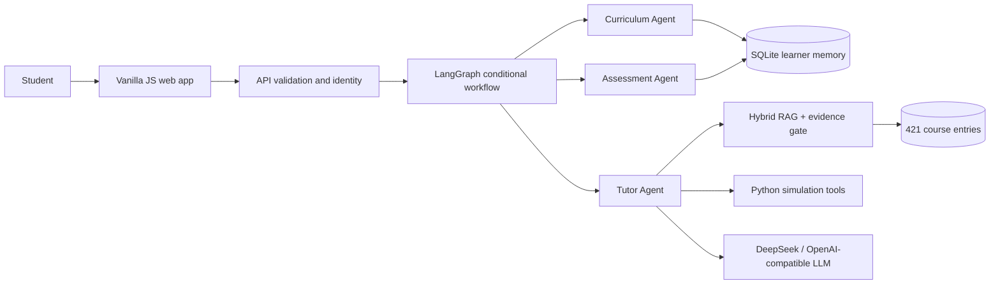

# 🎓 StochLab

### An adaptive AI Tutor for *Introduction to Stochastic Processes with Applications*

[English](README.md) · [简体中文](README.zh-CN.md) · [Svenska](README.sv.md)

[](https://github.com/JW35711/ai-tutor-for-stochastic-processes/actions/workflows/test.yml)
[](https://www.python.org/)
[](LICENSE)
[](web/index.html)

StochLab turns a collection of stochastic-process notebooks into a grounded,
multilingual learning product. It combines a curriculum-aware tutor, bounded
LangGraph orchestration, hybrid course retrieval, learner memory and verified
Python simulations. The system was developed from the teaching material for an
engineering-mathematics course at Uppsala University.


## Why I built this

The original degree project made stochastic mechanisms visible through Python
and Jupyter notebooks. The next engineering problem was to make the material
usable as a guided learning experience: a student should be able to ask a
question, receive an evidence-grounded explanation, try a verified experiment,
and see a next step based on their own learning history.

The result is intentionally a bounded educational system, not an open-ended
autonomous swarm. It keeps mathematical computation deterministic and
traceable while using an OpenAI-compatible LLM only for grounded teaching
synthesis.

## Try these flows

- **Learn:** “What is the Markov property?” → a concise explanation with
  course sources and a quick check.
- **Explore:** “Simulate Brownian motion with 100 steps.” → a Python-owned
  experiment, chart, parameters and teaching note.
- **Follow up:** “Show me.” or “Set lambda to 4.” → the active experiment is
  retained and parameters are updated without inventing numbers.
- **Practice:** answer a knowledge-point question, inspect the diagnosis,
  request a hint, retry, and see mastery evidence update.

## What the project demonstrates

- **Responsibility-bounded agents:** Curriculum Agent, Assessment Agent and
  Tutor Agent are coordinated by an explicit LangGraph `StateGraph`.
- **Grounded RAG:** 421 indexed entries combine notebooks, lecture notes,
  textbook pages and curated concept cards. An evidence-sufficiency gate
  distinguishes supported, partial, conflict and out-of-scope requests.
- **Verified computation:** 15 Python tools power 74 visualization targets.
  Simulation parameters and numerical results belong to Python tools; the LLM
  explains the verified output.
- **Adaptive learning:** 11 modules and 40 knowledge points have prerequisites,
  practice/quiz events, misconception notes and SQLite-backed recommendations.
- **Product engineering:** a lightweight Vanilla JS application, KaTeX math
  rendering, English/Chinese/Swedish UI and query-language handling, health and
  readiness probes, Docker hardening and CI evaluation.

## At a glance

| Curriculum | Knowledge points | Python tools | RAG entries | Visualization targets | Browser E2E |
| ---: | ---: | ---: | ---: | ---: | ---: |
| 11 modules | 40 | 15 | 421 | 74/74 | 11/11 |

## Architecture



The three agents have narrow responsibilities and share services. RAG,
evidence sufficiency, SQLite and Python tools are services—not additional
agents. The graph has explicit branches:

```text
navigation → curriculum
concept / why / comparison → retrieve → Tutor
simulation → retrieve → plan → Python tool → Tutor
practice / quiz → Assessment → memory → Tutor
```

This is a single AI Tutor application with bounded three-agent teaching
orchestration. It is not a free-form multi-agent platform.

## Tech stack

**Python · LangGraph · DeepSeek/OpenAI-compatible provider · hybrid sparse/dense
RAG · SQLite · NumPy · SciPy · Matplotlib · structured renderers · Vanilla
JavaScript/HTML/CSS · KaTeX · unittest · pytest · Playwright · Docker · GitHub
Actions**

## Evaluation

The repository keeps deterministic evaluation suites separate from the real
browser gate. The current corpus fingerprint is recorded in
[`docs/VERIFIED_METRICS.md`](docs/VERIFIED_METRICS.md).

Selected current results:

- core single-turn: **30/30**; multi-turn: **5/5**;
- structured 40-KP coverage: **120/120**;
- answerability/bad-path suite: **7/7**;
- experiment routing: **17/17**; visualization targets: **74/74**;
- multilingual offline suite: **43/43**; personalization: **33/33**;
- full pytest discovery: **341 passed**, with runtime and browser suites also
  runnable independently;
- browser acceptance: **11/11** real Chromium tests;
- credibility hard set: **99/129** in the current offline rerun. This is a
  deliberately difficult diagnostic, not a claim of general RAG accuracy;
- independent holdout: **15/32** end-to-end passes in the current standalone
  rerun (the manifest also records its separate 21/32 routing-pass view).

The generated current manifest is **447/488**. It keeps the hard set and
holdout visible as diagnostics rather than silently presenting the historical
477/488 artifact as current.

## Quick start

```bash
git clone https://github.com/JW35711/ai-tutor-for-stochastic-processes.git
cd ai-tutor-for-stochastic-processes
python3 -m venv .venv
source .venv/bin/activate
python -m pip install -r requirements.txt
cp .env.example .env
python server.py --host 127.0.0.1 --port 8000
```

Open <http://127.0.0.1:8000>. `LLM_API_KEY` is optional for a local demo; the
grounded fallback remains concise when no provider is configured. Never commit
`.env` or real credentials.

For the browser gate:

```bash
python -m pip install -r requirements-e2e.txt
python -m playwright install chromium
python -m pytest e2e -q
```

For the runtime gate:

```bash
python -m unittest discover -s tests -v
```

## Project links

- [Live repository](https://github.com/JW35711/ai-tutor-for-stochastic-processes)
- [Architecture](docs/ARCHITECTURE.md)
- [Verified metrics](docs/VERIFIED_METRICS.md)
- [Responsible AI notes](docs/RESPONSIBLE_AI.md)
- [Thesis-only simulation repository](https://github.com/JW35711/simulation-visualization-stochastic-processes)

## Current limitations

The corpus is course-specific and the current application is designed as a
single-node educational demo. Mastery is a transparent heuristic based on
practice and quiz evidence, not a psychometric assessment. SQLite is suitable
for a local or small deployment; OAuth, email recovery, multi-tenant
administration and distributed session storage are not included. Conflict
detection is deterministic for explicit contradictions; ambiguous semantic
entailment remains future work. KaTeX is loaded by the web client and provider
quality depends on the configured OpenAI-compatible endpoint.

## License

MIT. See [LICENSE](LICENSE) and [THIRD_PARTY_NOTICES.md](THIRD_PARTY_NOTICES.md).
