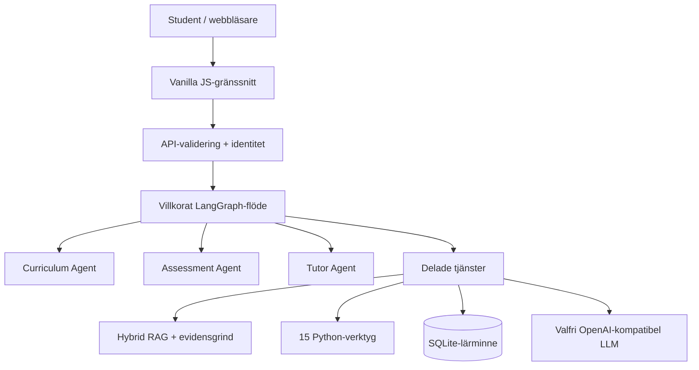

# 🎓 StochLab

### En adaptiv AI-handledare för *Introduction to Stochastic Processes with Applications*

[English](README.md) · [简体中文](README.zh-CN.md) · [Svenska](README.sv.md)

[](https://github.com/JW35711/ai-tutor-for-stochastic-processes/actions/workflows/test.yml)
[](https://www.python.org/)
[](LICENSE)
[](web/index.html)

StochLab gör strukturerat material om stokastiska processer, Jupyter-notebooks
och Python-experiment till en vägledd lärprodukt. LangGraph samordnar tre
ansvarsbegränsade Agents: Curriculum Agent, Assessment Agent och Tutor Agent.
RAG levererar kursbelägg, ett evidenslager kontrollerar om belägget räcker för
frågan, Python-verktyg äger de numeriska resultaten och bedömd evidens på
kunskapspunktsnivå driver nästa lärsteg.


## Varför jag byggde det

Utgångspunkten var ett verkligt projekt med undervisningsmaterial om stokastiska
processer. Det matematiska innehållet fanns redan; det som saknades var ett
vägledande lärflöde. Studenten behöver veta var man börjar, vilket begrepp en
fråga gäller, om materialet faktiskt räcker, när en simulering är användbar,
vad parametrarna betyder och vad nästa steg bör vara.

Den centrala ingenjörsfrågan blev därför: hur kan en LLM hjälpa till med
matematikundervisning utan att äga matematisk sanning eller beslut om
lärandestatus? Gränsen är explicit: LLM för språk och pedagogisk syntes, RAG
för kursbelägg, Python för numerik, Assessment för lärandebelägg, SQLite för
beständigt tillstånd, Curriculum för nästa aktivitet och LangGraph för
orkestrering.

Repositoryt beskriver en teknisk prototyp och gör inget anspråk på officiell
driftsättning eller institutionellt godkännande.

## Flöden att prova

- **Lär dig:** `What is the Markov property?` → kort kursgrundad förklaring och
  en snabb kontrollfråga.
- **Utforska:** `Simulate Brownian motion with 100 steps.` → ett registrerat
  Python-experiment, verifierade värden och en visualisering.
- **Följ upp:** `Show me.` eller `Set lambda to 4.` → aktivt experiment och
  relevanta parametrar bevaras.
- **Öva:** svara på en kunskapspunkt, be om en ledtråd, försök igen och se
  bedömd återkoppling samt nästa rekommendation.

## Vad skiljer projektet från en vanlig chatbot?

- **Relevans är inte tillräcklighet:** systemet kan komplettera, förtydliga,
  avstå eller visa en explicit konflikt i stället för att gissa.
- **LLM är inte en miniräknare:** registrerade Python-verktyg äger parametrar
  och numeriska resultat.
- **Samtal är inte mastery:** endast inskickad övnings- och quiz-evidens ändrar
  kunskapspunktens lärandebelägg.
- **En Agent är inte varje tjänst:** tre ansvarsbundna Agents samordnas av
  LangGraph; RAG, minne, verktyg och auth är tjänster.
- **Personalisering är inte bara chatthistorik:** beständig KP-evidens och
  förkunskaper väljer nästa aktivitet.
- **Beteendet testas i webbläsaren:** deterministiska tester kompletteras med
  riktiga Chromium-acceptanstester.

## I siffror

| Moduler | Kunskapspunkter | Python-verktyg | RAG-poster | Visualiseringsmål | Browser E2E |
| ---: | ---: | ---: | ---: | ---: | ---: |
| 11 | 40 | 15 | 421 | 74 | 11 riktiga fall |

## Arkitektur



Förfrågningar följer olika grenar, inte en fast `RAG → LLM`-kedja:

```text
concept → retrieve → evidence → (begränsad komplettering) → Tutor
simulation → retrieve → evidence → plan → Python → diagnose → Tutor
practice / quiz → Assessment → bedömd KP-evidens → Curriculum → Tutor
navigation → Curriculum → katalogsvar
social / general → samtalssvar (inga källor eller mastery-ändringar)
```

Det detaljerade runtime-state-kontraktet, nodvillkoren, de tre Agenternas
handoffs, answerability-loopen, response envelope och observability-fälten finns
i [`docs/ARCHITECTURE.md`](docs/ARCHITECTURE.md). Bilderna ovan är tagna från
den aktuella lokala versionen: separata appvyer, en chattfokuserad Tutor och en
fullbredds vy för den verifierade experimentkatalogen.

## Från notebooks till adaptiv Tutor

1. Kursmaterial och Python-simuleringar gjorde stokastiska mekanismer synliga.
2. En strukturerad kurskatalog och experimentregister gav stabila ID:n för
   moduler, kunskapspunkter, experiment och visualiseringar.
3. Hybrid RAG och answerability skiljde relevant evidens från tillräcklig
   evidens.
4. LangGraph gjorde de tre Agenternas ansvar och överlämningar explicita.
5. Bedömd evidens, KP-rekommendationer, auth, flerspråkigt gränssnitt,
   Docker/CI och Chromium-tester gjorde materialet till en lärprodukt.

## Viktiga ingenjörsbeslut

- Kursfrågor använder originalfrågan och avgränsad evidens; modulöversikten är
  navigationsmetadata och ersätter inte ett konkret svar.
- Evidensstatus är `SUPPORTED`, `PARTIAL`, `CONFLICT`, `NONE` eller
  `OUT_OF_SCOPE`.
- Simuleringsvärden skickas inte genom en LLM-omskrivning; Tutor förklarar det
  oförändrade Python-resultatet och dess källa.
- Mastery kallas *practice evidence*. Läsning, navigation, vanligt samtal,
  en ensam ledtråd och simuleringar ökar inte mastery.
- Kontolagret är prototypnivå: register/login/logout, HttpOnly-session och
  användarisolering, utan OAuth, lösenordsåterställning eller läraradmin.

## Teknik

**Python · LangGraph · DeepSeek/OpenAI-kompatibel provider · hybrid sparse/dense
RAG · SQLite · NumPy · SciPy · Matplotlib · strukturerade renderers · Vanilla
JavaScript/HTML/CSS · KaTeX · unittest · pytest · Playwright · Docker · GitHub
Actions**

## Utvärdering

Aktuell corpus-fingerprint och kommandon finns i
[`docs/VERIFIED_METRICS.md`](docs/VERIFIED_METRICS.md). Snapshoten visar:

- single-turn **30/30** och multi-turn **5/5**;
- strukturerad täckning av 40 KP **120/120**;
- answerability **7/7**;
- experiment-routing **17/17** och visualiseringsmål **74/74**;
- flerspråkigt offline **43/43** och personalisering **33/33**;
- riktiga Chromium-tester **11/11**;
- credibility hard set **99/129** och oberoende holdout **15/32** end-to-end
  (**21/32** routing-pass i manifestet).

Det aktuella genererade manifestet är **447/488**. Hard set och holdout är
avsiktligt svåra diagnostiska mått, inte ett generellt mått på retrieval-kvalitet.
Corpus-SHA och
det aktuella runtime-testantalet finns i `docs/VERIFIED_METRICS.md`.

## Snabbstart

```bash
git clone https://github.com/JW35711/ai-tutor-for-stochastic-processes.git
cd ai-tutor-for-stochastic-processes
python3 -m venv .venv
source .venv/bin/activate
python -m pip install -r requirements.txt
cp .env.example .env
python server.py --host 127.0.0.1 --port 8000
```

Öppna <http://127.0.0.1:8000>. Utan `LLM_API_KEY` fungerar den korta fallbacken
fortfarande. Lägg aldrig riktiga nycklar i Git.

Browser-gate:

```bash
python -m pip install -r requirements-e2e.txt
python -m playwright install chromium
python -m pytest e2e -q
```

Runtime-gate:

```bash
python -m unittest discover -s tests -v
```

## För rekryterare och intervjuare

- **1 minut:** läs motivationen och systemdiagrammet ovan.
- **5 minuter:** följ grenarna i [`docs/ARCHITECTURE.md`](docs/ARCHITECTURE.md).
- **Teknisk fördjupning:** se [`docs/API.md`](docs/API.md),
  [`docs/DEPLOYMENT.md`](docs/DEPLOYMENT.md) och
  [`docs/VERIFIED_METRICS.md`](docs/VERIFIED_METRICS.md).
- **Ansvarsgränser:** se [`docs/RESPONSIBLE_AI.md`](docs/RESPONSIBLE_AI.md).

## Aktuella begränsningar

Corpus är knutet till en introduktionskurs i stokastiska processer och svåra,
nya formuleringar kan fortfarande ge routingluckor. Fritextbedömning använder
deterministiska keyword/relation-kontroller; mastery är en transparent heuristik,
inte en psykometrisk modell. Explicit konfliktdetektering är starkare än
implicit semantisk konflikt. SQLite och den minimala auth-lösningen är
single-node-prototypskop. Lärandeeffekt i klassrum har inte validerats
experimentellt, och kvaliteten på KaTeX/provider beror på webbläsare och vald
endpoint.

## Licens

MIT. Se [LICENSE](LICENSE) och [THIRD_PARTY_NOTICES.md](THIRD_PARTY_NOTICES.md).

## Ett lätt, domänspecifikt Agent Harness

Den aktuella körningen har ett litet StochLab-specifikt Harness runt den
befintliga LangGraph-grafen. Det är en policygräns för exekvering, inte ett
generellt autonomt agentramverk: produkten har fortfarande exakt tre
avgränsade agenter (Curriculum, Assessment och Tutor), medan RAG,
answerability, Python-verktyg, SQLite och LLM-providern är separata,
inspekterbara tjänster.

```text
HTTP-begäran
  │
  ▼
Harness: request id → begränsad kontext (inga arrayer/hemligheter)
  │
  ▼
LangGraph: villkorad routing och handoffs
  ├─ navigation ─────────────► Curriculum → kurskatalog
  ├─ concept/why/comparison ─► RAG → evidensgrind → Tutor
  ├─ simulation ─────────────► RAG → plan → tillåtna Python-verktyg
  │                                 → verifiering → Tutor
  └─ practice/quiz ──────────► Assessment → Curriculum → Tutor
  │
  ▼
Harness: befintlig proveniens/numerisk kontroll + fallback + telemetry
```

Kontext komprimeras deterministiskt i ordningen **aktivt experiment och
validerade parametrar → modul/kunskapspunkt → bedömd lärarstatus → senaste
relevanta turer → äldre källreferenser**. Ingen tokenizer eller LLM används för
sammanfattning, och fullständiga prompts, chatthistorik, simuleringsarrayer och
hemligheter sparas inte. Endast registrerade simuleringsverktyg får köras; ingen
shell- eller godtycklig kodexekverare finns.

Harness ger ett request-id, en begränsad kontextpolicy, konservativ kontroll
efter körning, felkategorier och säker observability utan att duplicera routing,
retrieval, beräkning, bedömning eller rekommendation. Provider-retries och
circuit breaker ligger kvar i `src/llm.py`.
