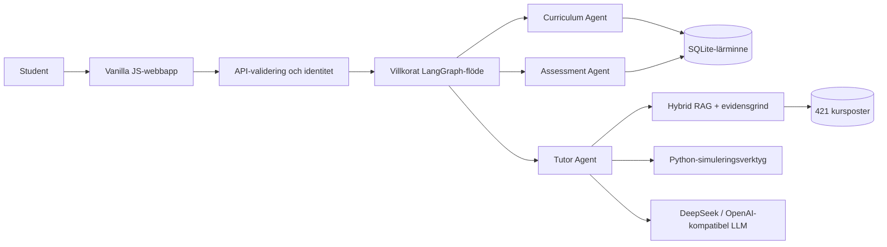

# 🎓 StochLab

### En adaptiv AI-handledare för *Introduction to Stochastic Processes with Applications*

[English](README.md) · [简体中文](README.zh-CN.md) · [Svenska](README.sv.md)

[](https://github.com/JW35711/ai-tutor-for-stochastic-processes/actions/workflows/test.yml)
[](https://www.python.org/)
[](web/index.html)

StochLab gör om notebook-material om stokastiska processer till en grundad,
flerspråkig lärprodukt. Systemet kombinerar kursstyrd handledning, ett
villkorat LangGraph-flöde, hybrid retrieval, lärarminne och verifierade Python-
simuleringar. Projektet bygger på undervisningsmaterial för en kurs i teknisk
matematik vid Uppsala universitet.


## Varför jag byggde det

Det ursprungliga examensprojektet gjorde stokastiska mekanismer synliga med
Python och Jupyter-notebooks. Nästa ingenjörsproblem var att göra materialet
användbart i ett lärflöde: studenten ska kunna ställa en fråga, få en
evidensbaserad förklaring, prova ett verifierat experiment och få ett nästa steg
utifrån sin egen historik.

Detta är ett avgränsat utbildningssystem, inte en öppen autonom agent-svärm.
Matematiska beräkningar är deterministiska och spårbara; en
OpenAI-kompatibel LLM används endast för att formulera undervisningssvar utifrån
evidens.

## Flöden att prova

- **Lär dig:** “What is the Markov property?” → kort förklaring, kurskällor och
  en snabb kontrollfråga.
- **Utforska:** “Simulate Brownian motion with 100 steps.” → Python-verktyget
  äger experimentet, diagrammet och parametrarna.
- **Följ upp:** “Show me.” eller “Set lambda to 4.” → aktivt experiment och
  parametrar bevaras utan att LLM:n hittar på tal.
- **Öva:** svara på en kunskapspunkt, få diagnos och ledtråd, försök igen och
  se hur evidensen för behärskning ändras.

## Vad projektet visar

- **Tydligt avgränsade agenter:** Curriculum Agent, Assessment Agent och Tutor
  Agent koordineras av en explicit LangGraph `StateGraph`.
- **Grundad RAG:** 421 poster från notebooks, föreläsningsanteckningar,
  lärobokssidor och kuraterade begreppskort; ett evidenslager skiljer mellan
  supported, partial, conflict och out-of-scope.
- **Verifierad beräkning:** 15 Python-verktyg täcker 74 visualiseringsmål.
  Python äger parametrar och numeriska resultat; LLM:n förklarar verifierad
  output.
- **Adaptivt lärande:** 11 moduler och 40 kunskapspunkter med förkunskaper,
  övnings-/quiz-händelser, missuppfattningar och SQLite-baserade rekommendationer.
- **Produktteknik:** Vanilla JS, KaTeX, engelska/kinesiska/svenska, health-
  endpoints, härdad Docker och CI-utvärdering.

## I siffror

| Moduler | Kunskapspunkter | Python-verktyg | RAG-poster | Visualiseringar | Browser E2E |
| ---: | ---: | ---: | ---: | ---: | ---: |
| 11 | 40 | 15 | 421 | 74/74 | 11/11 |

## Arkitektur



De tre agenterna har smala ansvarsområden och delar tjänster. RAG,
evidensgrinden, SQLite och Python-verktygen är tjänster – inte ytterligare
agenter. Flödet är:

```text
navigation → curriculum
concept / why / comparison → retrieve → Tutor
simulation → retrieve → plan → Python tool → Tutor
practice / quiz → Assessment → memory → Tutor
```

Detta är en enda AI-handledare med avgränsad tre-agent-koordinering, inte en
öppen multi-agent-plattform.

## Teknik

**Python · LangGraph · DeepSeek/OpenAI-kompatibel provider · hybrid sparse/dense
RAG · SQLite · NumPy · SciPy · Matplotlib · strukturerade renderers · Vanilla
JavaScript/HTML/CSS · KaTeX · unittest · pytest · Playwright · Docker · GitHub
Actions**

## Utvärdering

Aktuell corpus-fingerprint och reproduktionskommandon finns i
[`docs/VERIFIED_METRICS.md`](docs/VERIFIED_METRICS.md). Centrala resultat är:
30/30 single-turn, 5/5 multi-turn, 120/120 strukturerad kurs-täckning, 7/7
answerability, 17/17 experiment-routing, 74/74 visualiseringar, 43/43
flerspråkiga offlinefall, 33/33 personalisering och 11/11 riktiga Chromium-
tester. Den aktuella offline-körningen gav **99/129** på credibility hard set
och **15/32** fullständiga pass på den separata holdouten (manifestet visar också
21/32 som en separat routing-pass-vy). Det aktuella manifestet är **447/488**;
det äldre 477/488-resultatet är historiskt. Dessa är avsiktligt svåra diagnostiska
mått, inte generell RAG-accuracy.

## Snabbstart

```bash
git clone https://github.com/JW35711/ai-tutor-for-stochastic-processes.git
cd ai-tutor-for-stochastic-processes
python3 -m venv .venv
source .venv/bin/activate
python -m pip install -r requirements.txt
cp .env.example .env
python server.py --host 127.0.0.1 --port 8000
```

Öppna <http://127.0.0.1:8000>. Utan `LLM_API_KEY` fungerar den korta, grundade
fallbacken fortfarande. Lägg aldrig riktiga nycklar i Git.

Browser-gate:

```bash
python -m pip install -r requirements-e2e.txt
python -m playwright install chromium
python -m pytest e2e -q
```

Runtime-gate:

```bash
python -m unittest discover -s tests -v
```

## Projektlänkar

- [GitHub-repository](https://github.com/JW35711/ai-tutor-for-stochastic-processes)
- [Arkitektur](docs/ARCHITECTURE.md) · [Verifierade mått](docs/VERIFIED_METRICS.md)
- [Ansvarsfull AI](docs/RESPONSIBLE_AI.md)
- [Thesis-simulatorrepository](https://github.com/JW35711/simulation-visualization-stochastic-processes)

## Aktuella begränsningar

Corpus är kursspecifik och applikationen är främst avsedd för en nod eller liten
distribution. Mastery är en transparent heuristik från övnings- och quiz-evidens,
inte en psykometrisk bedömning. OAuth, e-poståterställning, multi-tenant-
administration och distribuerade sessioner ingår inte. Konfliktdetektering
hanterar explicita motsägelser; komplex semantisk entailment är framtida arbete.
KaTeX laddas i webbläsaren och LLM-kvaliteten beror på vald kompatibel endpoint.

## Licens

MIT. Se [LICENSE](LICENSE) och [THIRD_PARTY_NOTICES.md](THIRD_PARTY_NOTICES.md).
