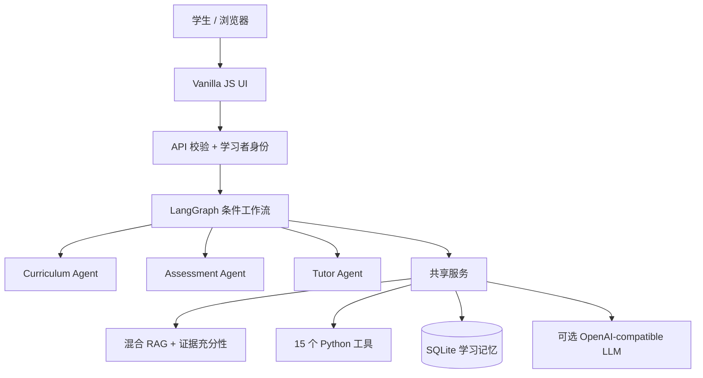

# 🎓 StochLab

### 面向 *Introduction to Stochastic Processes with Applications* 的自适应 AI Tutor

[English](README.md) · [简体中文](README.zh-CN.md) · [Svenska](README.sv.md)

[](https://github.com/JW35711/ai-tutor-for-stochastic-processes/actions/workflows/test.yml)
[](https://www.python.org/)
[](LICENSE)
[](web/index.html)

StochLab 将随机过程课程材料、Jupyter notebook 和 Python 实验组织成可交互
的学习产品。系统由 LangGraph 编排三个职责受限的 Agent：Curriculum Agent、
Assessment Agent 和 Tutor Agent；RAG 提供课程证据，证据充分性层判断证据是否
足以支持问题，Python 工具负责数值真值，知识点级测验证据驱动下一步学习。


## 为什么做这个项目

项目起点是真实的随机过程教学材料项目。数学内容本身并不缺，缺少的是引导式
学习体验：学生需要知道从哪里开始、问题对应哪个知识点、现有材料是否足以回答、
什么时候应该做模拟、参数代表什么，以及下一步学什么。

因此核心工程问题是：如何让 LLM 帮助讲解数学，同时不让它拥有数学真值或学习
状态决策权。边界是明确的：LLM 负责语言和教学表达，RAG 负责课程证据，Python
负责数值，Assessment 负责学习证据，SQLite 保存状态，Curriculum 选择下一步，
LangGraph 负责编排。

本仓库描述的是技术原型，不宣称已经被学校正式部署或认可。

## 可以直接体验的流程

- **学习：** `What is the Markov property?` → 基于课程证据的简洁解释和 quick check。
- **探索：** `Simulate Brownian motion with 100 steps.` → 注册的 Python 实验、
  验证后的数值和可视化。
- **追问：** `Show me.` 或 `Set lambda to 4.` → 保留当前实验，只继承相关参数。
- **练习：** 回答知识点问题、请求提示、重试，并查看测评反馈和下一步推荐。

## 它与普通聊天机器人的区别

- **相关不等于充分：** 证据不足时可以补充检索、澄清、拒答或提示显式冲突。
- **LLM 不是计算器：** 注册的 Python 工具拥有参数和数值输出。
- **对话不等于掌握：** 只有提交的练习和测验证据会改变知识点练习证据。
- **Agent 不是所有服务：** 三个职责受限 Agent 由 LangGraph 协调；RAG、记忆、
  工具和认证是服务层。
- **个性化不是简单拼接历史：** 持久化知识点证据和先修关系决定下一步动作。
- **不仅测试函数：** 确定性评测之外，还有真实 Chromium 浏览器验收。

## 核心规模

| 课程模块 | 知识点 | Python 工具 | RAG 条目 | 可视化目标 | 浏览器 E2E |
| ---: | ---: | ---: | ---: | ---: | ---: |
| 11 | 40 | 15 | 421 | 74 | 11 个真实用例 |

## 架构



请求不是一条固定的 `RAG → LLM` 流程：

```text
concept → retrieve → evidence →（有限补充检索）→ Tutor
simulation → retrieve → evidence → plan → Python → diagnose → Tutor
practice / quiz → Assessment → 知识点测验证据 → Curriculum → Tutor
navigation → Curriculum → 课程目录响应
social / general → 对话响应（无课程来源、无掌握度变更）
```

更细的运行时状态契约、节点条件、三个 Agent 的 handoff、answerability
循环、响应 envelope 和可观测字段见
[`docs/ARCHITECTURE.md`](docs/ARCHITECTURE.md)。上面的截图来自当前本地版本：
独立应用视图、聊天优先的 Tutor，以及全宽的验证实验目录页。

## 从 Notebook 到自适应 Tutor

1. 课程材料和 Python 模拟让随机机制可见。
2. 结构化课程目录和实验注册表提供稳定的模块、知识点、实验和可视化 ID。
3. 混合 RAG 与 answerability 将“相关证据”和“足以回答”分开。
4. LangGraph 将三个 Agent 的职责边界和交接显式化。
5. 测评证据、知识点推荐、认证、多语言 UI、Docker/CI 和 Chromium 测试把材料
   变成可用的学习产品。

## 关键工程决策

- 课程回答使用原始问题和有界证据；模块简介只是导航信息，不能替代具体回答。
- 证据状态包括 `SUPPORTED`、`PARTIAL`、`CONFLICT`、`NONE` 和 `OUT_OF_SCOPE`。
- 模拟数值不会经过 LLM 改写；Tutor 只解释不可变的 Python 结果及其来源。
- 掌握度标为 *practice evidence*；阅读、导航、普通对话、单独请求提示和模拟
  都不会增加掌握度。
- 账号层是面向原型的 register/login/logout、HttpOnly 会话和用户隔离，不包含
  OAuth、找回密码或教师后台。

## 技术栈

**Python · LangGraph · DeepSeek/OpenAI-compatible provider · hybrid sparse/dense
RAG · SQLite · NumPy · SciPy · Matplotlib · structured renderers · Vanilla
JavaScript/HTML/CSS · KaTeX · unittest · pytest · Playwright · Docker · GitHub
Actions**

## 评测结果

当前 corpus 指纹和复现命令见 [`docs/VERIFIED_METRICS.md`](docs/VERIFIED_METRICS.md)。
当前结果包括：核心单轮 **30/30**、多轮 **5/5**；40 个知识点结构化覆盖
**120/120**；answerability **7/7**；实验路由 **17/17**；可视化目标 **74/74**；
离线多语言 **43/43**；个性化 **33/33**；真实 Chromium 浏览器 **11/11**；
credibility hard set **99/129**；独立 holdout 端到端 **15/32**（manifest 另有
**21/32** 的 routing-pass 视图）。

当前生成的 manifest 为 **447/488**。hard set 和 holdout 是刻意设置的困难诊断，
不是通用检索质量分数。
corpus SHA 和当前运行时测试数量以
`docs/VERIFIED_METRICS.md` 为准。

## 快速运行

```bash
git clone https://github.com/JW35711/ai-tutor-for-stochastic-processes.git
cd ai-tutor-for-stochastic-processes
python3 -m venv .venv
source .venv/bin/activate
python -m pip install -r requirements.txt
cp .env.example .env
python server.py --host 127.0.0.1 --port 8000
```

打开 <http://127.0.0.1:8000>。没有 `LLM_API_KEY` 也可以运行本地演示，系统会使用
简洁 fallback。不要提交 `.env` 或真实密钥。

浏览器验收：

```bash
python -m pip install -r requirements-e2e.txt
python -m playwright install chromium
python -m pytest e2e -q
```

运行时测试：

```bash
python -m unittest discover -s tests -v
```

## 招聘方 / 面试官入口

- **1 分钟：** 阅读上面的动机和系统架构图。
- **5 分钟：** 阅读 [`docs/ARCHITECTURE.md`](docs/ARCHITECTURE.md) 的请求分支。
- **技术深挖：** 查看 [`docs/API.md`](docs/API.md)、[`docs/DEPLOYMENT.md`](docs/DEPLOYMENT.md)
  和 [`docs/VERIFIED_METRICS.md`](docs/VERIFIED_METRICS.md)。
- **责任边界：** 查看 [`docs/RESPONSIBLE_AI.md`](docs/RESPONSIBLE_AI.md)。

## 当前限制

语料面向一门入门随机过程课程，困难的未见自然语言仍可能出现路由缺口。自由文本
评测使用确定性的关键词/关系检查；掌握度是透明启发式，不是心理测量模型。显式
矛盾检测强于隐式语义冲突检测。SQLite 和最小认证层是单节点原型范围；课堂学习
效果尚未做实验验证，KaTeX 和 LLM 质量取决于浏览器及兼容服务配置。

## License

MIT，详见 [LICENSE](LICENSE) 和 [THIRD_PARTY_NOTICES.md](THIRD_PARTY_NOTICES.md)。

## 轻量领域 Agent Harness

当前运行时在既有 LangGraph 图外增加了一个 StochLab 专用的轻量 Harness。
它是执行策略边界，不是通用自主 Agent 框架：系统仍然只有 Curriculum、
Assessment、Tutor 三个有界 Agent；RAG、可回答性、Python 工具、SQLite 和
LLM provider 仍是可检查的独立服务。

```text
HTTP 请求
  │
  ▼
Harness：request id → 有界上下文快照（不含数组/密钥）
  │
  ▼
LangGraph：条件路由与 handoff
  ├─ 导航 ───────────────► Curriculum → 课程目录回答
  ├─ 概念/解释/比较 ─────► RAG → 证据门控 → Tutor
  ├─ 仿真 ───────────────► RAG → plan → 白名单 Python 工具
  │                              → 校验 → Tutor
  └─ practice/quiz ─────► Assessment → Curriculum → Tutor
  │
  ▼
Harness：复用来源/数值校验 + 安全 fallback + debug telemetry
```

上下文压缩完全由确定性规则完成，优先级为：**当前实验和已验证参数 →
模块/知识点 → 已评估学习状态 → 最近相关轮次 → 更旧的来源定位**。不使用
tokenizer 或 LLM 摘要，也不保存完整 prompt、完整聊天记录、仿真数组或密钥。
仿真只能调用已注册工具，不提供 shell 或任意代码执行器。

引入 Harness 的原因，是为每次执行统一提供 request id、有界上下文策略、保守的
执行后校验、失败分类和安全观测，而不把路由、检索、计算、评分或推荐复制到
另一套框架。Provider 的重试和 circuit breaker 仍由 `src/llm.py` 负责。
