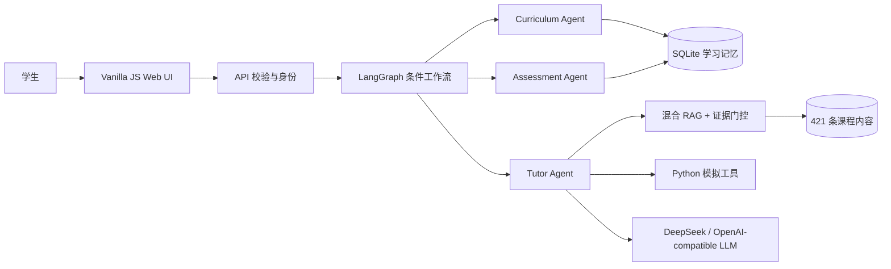

# 🎓 StochLab

### 面向《Introduction to Stochastic Processes with Applications》的自适应 AI Tutor

[English](README.md) · [简体中文](README.zh-CN.md) · [Svenska](README.sv.md)

[](https://github.com/JW35711/ai-tutor-for-stochastic-processes/actions/workflows/test.yml)
[](https://www.python.org/)
[](web/index.html)

StochLab 将随机过程 notebook 转化为一个有证据依据、支持多语言的学习
产品。它结合课程路由、LangGraph 条件编排、混合检索、学习者记忆和经过
验证的 Python 模拟。项目基于乌普萨拉大学工程数学课程的教学材料开发。


## 为什么做这个项目

原始毕设通过 Python 和 Jupyter notebook 让随机机制变得可见。下一步的工程
问题是：学生提出问题后，系统能给出有课程证据支撑的解释，让学生运行经过
验证的实验，并根据自己的学习记录得到下一步建议。

这是一个职责边界清晰的教育系统，不是开放式的自主 Agent 集群。数学计算
保持确定、可追踪；OpenAI-compatible LLM 只负责基于证据组织教学表达。

## 可以直接体验的流程

- **学习：** “What is the Markov property?” → 简洁解释、课程来源和一个
  quick check。
- **探索：** “Simulate Brownian motion with 100 steps.” → Python 工具负责
  实验、图表、参数和教学说明。
- **追问：** “Show me.” 或 “Set lambda to 4.” → 保留当前实验并更新参数，
  不让 LLM 编造数值。
- **练习：** 回答知识点问题，查看诊断、提示和重试，观察 SQLite 中的掌握
  证据变化。

## 项目体现的能力

- **职责边界明确的 Agent：** Curriculum Agent、Assessment Agent、Tutor
  Agent 由显式 LangGraph `StateGraph` 协调。
- **有依据的 RAG：** 421 条索引内容来自 notebook、讲义、教材页面和整理的
  概念卡；证据充分性层区分 supported、partial、conflict 和 out-of-scope。
- **可验证的计算：** 15 个 Python 工具覆盖 74 个可视化目标；参数和数值由
  Python 所有，LLM 只解释验证后的输出。
- **自适应学习：** 11 个模块、40 个知识点，包含先修关系、练习/测验事件、
  误解提示和基于 SQLite 的推荐。
- **产品工程：** Vanilla JS、KaTeX、中英瑞典语界面和查询语言处理、健康
  检查、Docker 加固以及 CI 评测。

## 核心规模

| 课程模块 | 知识点 | Python 工具 | RAG 条目 | 可视化目标 | 浏览器 E2E |
| ---: | ---: | ---: | ---: | ---: | ---: |
| 11 | 40 | 15 | 421 | 74/74 | 11/11 |

## 架构



三个 Agent 负责不同职责；RAG、证据充分性、SQLite 和 Python 工具是共享
服务，不是额外的 Agent。当前分支为：

```text
navigation → curriculum
concept / why / comparison → retrieve → Tutor
simulation → retrieve → plan → Python tool → Tutor
practice / quiz → Assessment → memory → Tutor
```

这是一个带有限三 Agent 教学编排的单一 AI Tutor 应用，不是开放式多 Agent
平台。

## 技术栈

**Python · LangGraph · DeepSeek/OpenAI-compatible provider · hybrid sparse/dense
RAG · SQLite · NumPy · SciPy · Matplotlib · structured renderers · Vanilla
JavaScript/HTML/CSS · KaTeX · unittest · pytest · Playwright · Docker · GitHub
Actions**

## 评测结果

当前 corpus 指纹和复现命令见
[`docs/VERIFIED_METRICS.md`](docs/VERIFIED_METRICS.md)。主要结果：核心单轮
30/30、多轮 5/5；40 知识点结构化覆盖 120/120；证据充分性 7/7；实验路由
17/17；可视化目标 74/74；离线多语言 43/43；个性化 33/33；真实 Chromium
浏览器 11/11。当前离线重跑的 credibility hard set 为 **99/129**，独立
holdout 的端到端通过数为 **15/32**（manifest 另外记录 21/32 的 routing-pass
视图）。当前生成的 manifest 为 **447/488**；旧的 477/488 只保留为历史结果，
不能当作当前基线，也不能把 hard set 包装成通用 RAG 准确率。

## 快速运行

```bash
git clone https://github.com/JW35711/ai-tutor-for-stochastic-processes.git
cd ai-tutor-for-stochastic-processes
python3 -m venv .venv
source .venv/bin/activate
python -m pip install -r requirements.txt
cp .env.example .env
python server.py --host 127.0.0.1 --port 8000
```

打开 <http://127.0.0.1:8000>。没有 `LLM_API_KEY` 也可以运行本地演示，系统
会使用简洁、有依据的 fallback。不要提交 `.env` 或真实密钥。

浏览器测试：

```bash
python -m pip install -r requirements-e2e.txt
python -m playwright install chromium
python -m pytest e2e -q
```

运行时测试：

```bash
python -m unittest discover -s tests -v
```

## 项目链接

- [GitHub 仓库](https://github.com/JW35711/ai-tutor-for-stochastic-processes)
- [架构](docs/ARCHITECTURE.md) · [验证指标](docs/VERIFIED_METRICS.md)
- [Responsible AI](docs/RESPONSIBLE_AI.md)
- [论文模拟项目](https://github.com/JW35711/simulation-visualization-stochastic-processes)

## 当前限制

语料面向单门课程，应用主要面向单节点或小规模部署。掌握度是根据练习和
测验证据计算的透明启发式，不是心理测量。SQLite、OAuth、邮箱找回、多租户
管理和分布式会话不是本版本范围。冲突检测能处理显式矛盾，复杂的语义蕴含
判断留待后续；KaTeX 由 Web 客户端加载，LLM 质量取决于所配置的兼容服务。

## License

MIT，详见 [LICENSE](LICENSE) 和 [THIRD_PARTY_NOTICES.md](THIRD_PARTY_NOTICES.md)。
