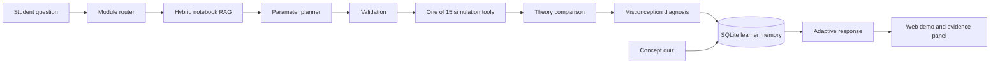

# Architecture

The project separates probabilistic computation from language generation. The
Python tools own all numerical results; an optional language model may only
rewrite the verified explanation.



## Components

| Component | Responsibility | Why it is separate |
| --- | --- | --- |
| `workflow.py` | Runs the typed seven-node state graph | Node order and state transitions can be tested without the web layer |
| `module_registry.py` | Routes Chinese and English questions to Modules 00–10 | Routing can be evaluated independently |
| `knowledge.py` | Indexes curated cards and Markdown cells, then returns scored evidence | Retrieval remains local, traceable and replaceable |
| `processes/` | Runs 15 validated stochastic simulations | The LLM cannot invent or modify numerical output |
| `pedagogy.py` | Detects explicitly stated misconceptions | Diagnoses are transparent rather than hidden in a prompt |
| `assessment.py` | Serves and grades module concept checks | Quiz results provide evidence beyond tool execution |
| `memory.py` | Persists turns, tool parameters, quizzes and per-module progress in SQLite | Learner state and follow-up context survive server restarts |
| `agent.py` | Orchestrates retrieval, tools, verification and response | Provides a single API boundary |
| `evals/` | Measures routing, tool, citation and trace accuracy | Agent changes have a repeatable acceptance gate |

## Retrieval

At startup, the retriever loads 11 curated knowledge cards and extracts
Markdown teaching cells from all 11 notebooks. It uses IDF-weighted sparse
terms plus Chinese character bigrams and trigrams. Results are restricted to
the routed module and expose a score, source type and exact `#cell-N` locator.

This is an offline hybrid sparse RAG implementation, not an embedding model.
The `retrieve()` boundary is intentionally stable so an embedding or reranking
backend can be added later without changing the simulation tools.

## State graph

`AgentState` is the single object passed through seven named nodes:

```text
classify → retrieve → plan → tool → diagnose → memory → respond
```

Each handler owns a small set of state fields and returns a trace description.
The graph validates unique node names and exposes its declared node contract in
every API response. This local implementation keeps the offline server free of
framework dependencies; its node signatures are deliberately close to hosted
graph orchestrators so a LangGraph adapter is an integration change rather
than another rewrite of the tools.

## Learner model

The learner profile distinguishes three forms of evidence:

1. successful validated simulation runs;
2. concept-check accuracy;
3. repeated misconception triggers.

The displayed score is labelled *practice evidence*. It is not presented as a
psychometrically validated estimate of ability. That distinction is important
in an education product.

## Multi-turn state

Each successful turn stores the routed module, selected tool and validated
parameters. If the next turn omits the model, the Agent inherits the previous
module and tool. It carries forward only parameters that the learner did not
explicitly replace. The `classify` and `plan` trace entries state whether the
module or individual parameters came from context. SQLite schema migration adds
the parameter column to existing local profiles without deleting earlier turns.

## Reliability and safety

- Invalid model parameters fail before a chart is generated.
- M/M/1 stability is checked before a stationary distribution is discussed.
- Numerical functions receive explicit seeds for reproducible tests.
- Normal notebook use remains unseeded, matching the thesis teaching design.
- LLM use is optional; offline mode supports every simulation and assessment.
- Third-party reference PDFs are excluded from version control.
