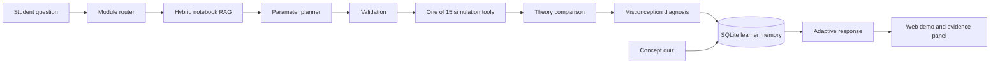

# Architecture

The project separates probabilistic computation from language generation. The
Python tools own all numerical results; an optional language model may only
rewrite the verified explanation.

The rewrite boundary is enforced after generation: every number and exact
Notebook source locator in the deterministic draft must remain present. A
candidate that drops or changes an anchor is discarded, and the offline draft
is returned. Prompt instructions are therefore not the only grounding control.



## Components

| Component | Responsibility | Why it is separate |
| --- | --- | --- |
| `workflow.py` | Runs the typed seven-node state graph | Node order and state transitions can be tested without the web layer |
| `module_registry.py` | Routes Chinese and English questions to Modules 00–10 | Routing can be evaluated independently |
| `knowledge.py` | Indexes curated cards and Markdown cells, then hybrid-ranks evidence | Retrieval remains traceable and replaceable |
| `embeddings.py` | Provides local hash and optional OpenAI-compatible vectors | Neural retrieval is optional, while offline behavior remains deterministic |
| `processes/` | Runs 15 validated stochastic simulations | The LLM cannot invent or modify numerical output |
| `pedagogy.py` | Detects explicitly stated misconceptions | Diagnoses are transparent rather than hidden in a prompt |
| `assessment.py` | Serves and grades module concept checks | Quiz results provide evidence beyond tool execution |
| `memory.py` | Persists turns, tool parameters, quizzes and per-module progress in SQLite | Learner state and follow-up context survive server restarts |
| `runtime.py` | Implements rate limiting, request metrics and structured events | HTTP protection remains independent of tutoring logic |
| `evaluation_manifest.py` | Validates the evaluation summary shown in health and UI | Dashboard counts cannot silently drift from case files |
| `tool_catalog.py` | Exposes function descriptions, module ownership and parameter contracts | Tool use is inspectable without reading orchestrator code |
| `agent.py` | Orchestrates retrieval, tools, verification and response | Provides a single API boundary |
| `evals/` | Measures routing, tool, citation and trace accuracy | Agent changes have a repeatable acceptance gate |

## Retrieval

At startup, the retriever loads 11 curated knowledge cards and extracts
Markdown teaching cells from all 11 notebooks. It combines IDF-weighted sparse
terms, Chinese character bigrams and trigrams, and cosine similarity over a
vector index. Results are restricted to the routed module and expose sparse,
vector and bonus score components, the backend name, source type and exact
`#cell-N` locator.

The default 384-dimensional hash vectorizer is deterministic and offline. It
helps with wording variation but is not described as a neural semantic model.
An OpenAI-compatible embedding backend can batch-index the same entries when
explicitly configured. A failed hosted configuration falls back to the local
backend and reports the reason through `/health`.

Retrieval is regression-tested separately from end-to-end routing. The
22-case suite spans all eleven modules and reports Hit@3 and mean reciprocal
rank. Keeping this suite separate makes a future neural embedding change
measurable instead of relying on a subjective UI demonstration.

Teaching behavior has a second independent gate: ten cases cover all six
explicit misconception rules plus neutral controls. The evaluator requires
every correction to appear in the answer and every successful tool response
to include experiment, interpretation, guiding question and source sections.

## State graph

`AgentState` is the single object passed through seven named nodes:

```text
classify → retrieve → plan → tool → diagnose → memory → respond
```

Each handler owns a small set of state fields and returns a trace description.
The graph validates unique node names and exposes its declared node contract in
every API response. This local implementation keeps the offline server free of
framework dependencies; its node signatures are deliberately close to hosted
graph orchestrators so a LangGraph adapter is an integration change rather
than another rewrite of the tools.

Every trace entry also records `status` and `duration_ms`. If a node raises,
the failed node and exception type are appended before the error propagates.
This gives the UI node-level latency and failure evidence without exposing
private reasoning text.

## Learner model

The learner profile distinguishes three forms of evidence:

1. successful validated simulation runs;
2. concept-check accuracy;
3. repeated misconception triggers.

The displayed score is labelled *practice evidence*. It is not presented as a
psychometrically validated estimate of ability. That distinction is important
in an education product.

## Multi-turn state

Each successful turn stores the routed module, selected tool and validated
parameters. If the next turn omits the model, the Agent inherits the previous
module and tool. It carries forward only parameters that the learner did not
explicitly replace. The `classify` and `plan` trace entries state whether the
module or individual parameters came from context. SQLite schema migration adds
the parameter column to existing local profiles without deleting earlier turns.

## Reliability and safety

- Invalid model parameters fail before a chart is generated.
- M/M/1 stability is checked before a stationary distribution is discussed.
- Numerical functions receive explicit seeds for reproducible tests.
- Normal notebook use remains unseeded, matching the thesis teaching design.
- LLM use is optional; offline mode supports every simulation and assessment.
- Third-party reference PDFs are excluded from version control.
- Each API response carries a request ID and browser security headers.
- POST requests are bounded by body size, question length and a per-client
  sliding-window rate limit.
- Logs contain route, status and latency, but not the learner's question text.

Runtime counters are deliberately process-local, matching the current
single-instance deployment. A multi-instance version should place rate limits
in Redis and export metrics to an OpenTelemetry-compatible collector.
