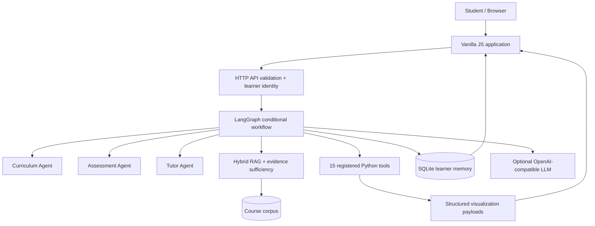
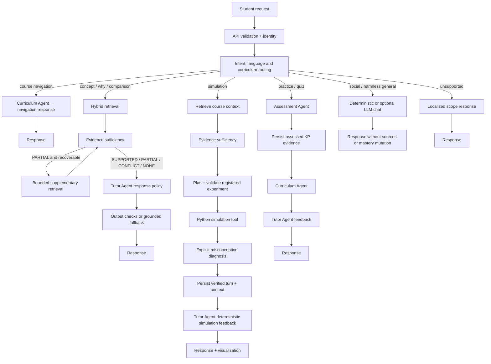
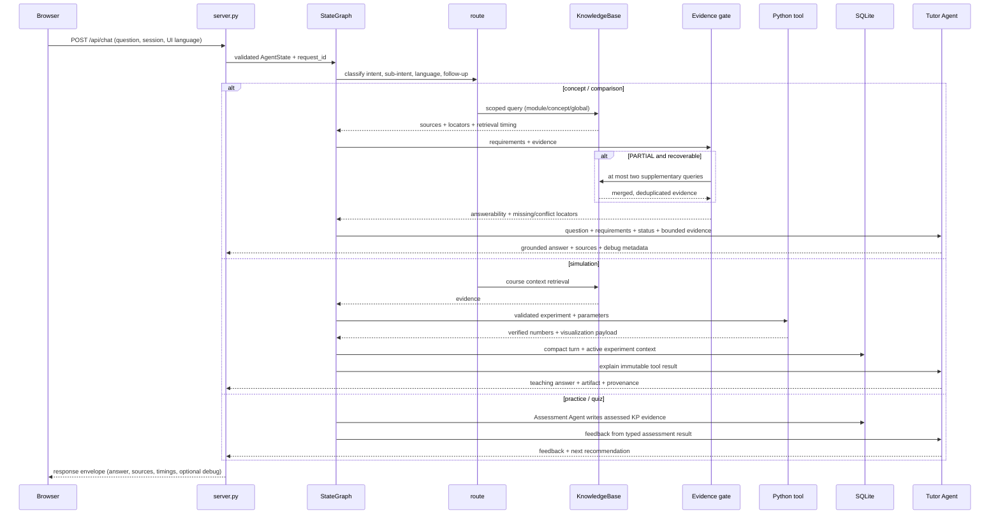
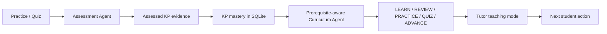

# Architecture

StochLab is one AI Tutor application with a responsibility-bounded, three-agent
teaching architecture coordinated by LangGraph. The three Agents are
`Curriculum Agent`, `Assessment Agent` and `Tutor Agent`. Retrieval, evidence
sufficiency, embeddings, Python simulations, SQLite and authentication are
services or infrastructure; they are not additional Agents.

The central design boundary is:

| Concern | Owner |
| --- | --- |
| Language and pedagogical phrasing | Optional OpenAI-compatible LLM |
| Course facts and provenance | Hybrid course RAG |
| Whether the evidence supports the requested claim | Deterministic evidence-sufficiency layer |
| Numerical parameters, simulation results and validation | Registered Python tools |
| What the learner has demonstrated | Assessment and deterministic mastery policy |
| Next learning action | Curriculum Agent |
| Request sequencing and handoffs | LangGraph `StateGraph` |

The result is deliberately not an autonomous agent swarm and not a simple
`RAG → LLM` pipeline.

## System architecture

This first diagram is the recruiter-level view. It distinguishes the three
bounded responsibility Agents from shared services.



The graph coordinates the Agents and services. A normal concept request uses
the Tutor Agent after retrieval; a simulation request additionally uses the
Python tool path; an assessment request invokes Assessment and Curriculum
handoffs. The LLM is a presentation service: it can synthesize a course answer
from bounded evidence or answer harmless general chat, but it cannot own
simulation numbers or learner-state decisions.

## Request execution flow

The second diagram follows the compiled graph in `src/graph/workflow.py` and
the domain handlers in `src/agent.py`.



## Runtime state, node contracts and handoffs

The graph is stateful at the request level. Each node reads a small, typed
slice of `TutorState`, adds evidence or a decision, and leaves the rest of the
state unchanged. This is the detail that is hidden by a simple box-and-arrow
architecture diagram.



### State contract

`src/workflow.py` remains the compatibility domain state; `src/graph/state.py`
wraps it for the compiled graph. The important fields are grouped below so a
reviewer can see what is carried between nodes without reading every handler.

| State group | Representative fields | Written by | Read by |
| --- | --- | --- | --- |
| Request and identity | `question`, `session_id`, `request_id`, `ui_language` | HTTP layer | route, memory, response |
| Routing | `intent`, `sub_intent`, `follow_up`, `module_id`, `concept_id`, `related_*_ids` | `route` | graph edges, retrieval, Tutor |
| Evidence | `retrieval_query`, `sources`, `question_requirements`, `answerability_status`, `missing_requirements`, `conflicting_source_locators`, `retrieval_rounds` | `retrieve`, `evidence`, `supplement` | Tutor, response |
| Experiment | `tool_key`, `tool_parameters`, `tool_result`, `tool_verified`, `active_experiment` | `plan`, `tool`, `memory` | diagnosis, Tutor, UI |
| Learning state | `assessment`, `misconceptions`, `mastery`, `curriculum_decision`, `teaching_mode` | Assessment handoff, Curriculum Agent | Tutor, profile UI |
| Delivery and observability | `answer`, `sources`, `visited_nodes`, `route`, `agents_invoked`, `handoffs`, `stage_timings`, `llm_*`, `tool_called` | `respond` | API client, debug view, evaluation |

### Node and handoff boundaries

| Graph node | Conditional entry | Contract / side effect |
| --- | --- | --- |
| `route` | Every request | Classifies intent and language; it never retrieves or calls a tool. |
| `curriculum` / `navigation` | Navigation, or after assessment | Reads the catalogue and prerequisites; returns stable IDs and a next action. |
| `retrieve` → `evidence` | Concept, comparison, simulation | Retrieves bounded course evidence and classifies `SUPPORTED`, `PARTIAL`, `CONFLICT`, `NONE` or `OUT_OF_SCOPE`. |
| `supplement` | Recoverable `PARTIAL` | Rewrites the missing requirement and performs a bounded additional retrieval; no unbounded loop. |
| `plan` → `tool` | Explicit simulation only | Validates the registered experiment and parameters; Python owns all numerical output. |
| `diagnose` → `memory` | Successful simulation | Adds a compact misconception/result summary and active experiment context to SQLite. |
| `assessment` | Practice or quiz | Grades the attempt deterministically and writes assessed knowledge-point evidence. |
| `respond` | Answer-producing branches | Applies the Tutor Agent policy, output checks, provenance and timing envelope. |

The three Agents have intentionally narrow handoff contracts:

| Agent | Receives | Returns | Must not do |
| --- | --- | --- | --- |
| Curriculum Agent | Curriculum catalogue, prerequisites, assessed KP evidence | `LEARN` / `REVIEW` / `PRACTICE` / `QUIZ` / `ADVANCE` decision | Invent course content, grade answers or call tools |
| Assessment Agent | Question, student answer, target KP and rubric | Deterministic correctness, misconception and mastery evidence | Generate the final lesson or modify unrelated KPs |
| Tutor Agent | Original question, evidence status, bounded evidence, tool/assessment result | Concise teaching response and follow-up | Retrieve, calculate, overrule answerability or mutate mastery |

### Response envelope and observability

The browser normally receives the student-facing answer plus source locators and
experiment artifacts. Technical diagnostics stay behind `?debug=1` and in
server metrics. `src/graph/response.py` finalizes one envelope for every branch:

```text
{
  "request_id", "intent", "sub_intent", "module_id", "concept_id",
  "answer", "sources", "answerability_status", "tool_called", "tool_key",
  "llm_enabled", "llm_applied", "provider", "model", "retry_count",
  "stage_timings": {"routing", "retrieval", "answerability", "llm",
                    "simulation", "total"},
  "visited_nodes", "agents_invoked", "handoffs"
}
```

This makes a simulation auditable from the browser response back to a stable
experiment ID and Python renderer, while a concept answer can be audited from
its claim to source locators and the evidence decision. It also explains why
social/general chat has no course sources and why navigation has no RAG round.

### Concept and comparison requests

`POST /api/chat` becomes an `AgentState` and enters `route → retrieve →
evidence`. Retrieval is scoped to the matched knowledge point/module when
possible, with a global fallback for supported course questions. The evidence
layer checks the requested claim rather than treating non-empty sources as
proof. A `PARTIAL` result may trigger at most two supplementary retrieval
rounds. Explicit contradictions are surfaced instead of silently selecting a
side. The Tutor Agent then chooses synthesis, clarification, abstention or
conflict wording. A hosted synthesis receives the original question,
question requirements, answerability status and bounded evidence; it never
receives raw simulation arrays or learner history.

### Simulation requests

The simulation branch still retrieves course context first, but only an
explicit simulation request reaches `plan → tool`. `ExperimentRegistry` and
`tool_catalog.py` select one of the registered experiments and the Python
function validates parameters and resource limits. The result is the sole
numerical authority. Diagnosis looks only for explicit misconception triggers;
then SQLite stores compact context and the Tutor Agent explains the verified
result without asking the LLM to recalculate it. Visualization data is returned
through the existing renderer contract and can be followed up with stable
experiment IDs and parameter updates.

### Practice and quiz requests

Practice and quiz routes send a reviewed assessment payload through
`Assessment Agent`. The handoff records the attempt, updates only the target
knowledge point's deterministic practice evidence, reloads the learner profile,
and calls `Curriculum Agent` to inspect prerequisites and recent mistakes. The
Tutor Agent turns that typed decision into feedback. Reading, navigation,
concept chat, hints alone and simulation runs do not increase mastery.

### Navigation, social and general chat

Navigation is read-only catalog access: `Curriculum Agent` reads
`data/curriculum.json` and the UI displays a module or knowledge-point view.
Social acknowledgements bypass RAG, evidence sufficiency, tools and memory.
Harmless general questions may use the optional LLM, but receive no fabricated
course sources and do not alter mastery. Unsupported or policy-sensitive
questions receive a short localized scope response.

## Adaptive learning loop

This is the smallest useful view of personalization. It is an assessed-evidence
loop, not a claim that ordinary chat measures learning.



`src/mastery.py` applies the bounded update policy. `src/recommendation.py`
selects the next actionable knowledge point, while `src/agents/curriculum.py`
returns stable IDs and a reason. Module aggregates are display heuristics; an
unassessed prerequisite remains `NOT_STARTED`.

## Code trace

| Stage | Representative implementation |
| --- | --- |
| HTTP entry, validation and auth resolution | `server.py` |
| Graph state and conditional edges | `src/graph/state.py`, `src/graph/workflow.py` |
| Compatibility domain state | `src/workflow.py` |
| Curriculum decisions | `src/agents/curriculum.py`, `src/agents/handoffs.py` |
| Assessment grading | `src/agents/assessment.py`, `src/assessment.py` |
| Tutor policy and feedback | `src/agents/tutor.py`, `src/agent.py` |
| Retrieval and answerability | `src/knowledge.py`, `src/embeddings.py`, `src/agent.py` |
| Registered experiments and tools | `src/experiments.py`, `src/tool_catalog.py`, `src/processes/` |
| Diagnosis and pedagogy | `src/pedagogy.py` |
| Learner state and context | `src/memory.py`, `src/mastery.py`, `src/recommendation.py` |
| Authentication primitives | `src/auth.py` |
| Safe output and provenance | `src/llm.py`, `src/provenance.py`, `src/graph/response.py` |
| Curriculum and experiment catalogues | `data/curriculum.json`, `data/notebook_experiments.json` |
| Browser client and KaTeX | `web/app.js`, `web/index.html` |

## Retrieval and evidence boundary

The `KnowledgeBase` indexes curated concept cards, Markdown notebook cells,
reviewed lecture-note chunks and generated textbook chunks when the local index
exists. The current snapshot contains 421 entries across 11 modules and 40
knowledge points. Sparse term scoring, character n-grams and deterministic
384-dimensional local-hash vectors are combined; an optional hosted embedding
backend can be enabled without replacing the offline path. Every result keeps
its source locator and corpus fingerprint.

Answerability is deliberately deterministic: requirement coverage rules,
explicit contradiction checks and at most two supplementary retrieval rounds.
Relevance is not treated as sufficiency. The current conflict detector handles
explicit contradictory claims; implicit semantic contradiction and full
entailment are future work. A future hybrid design could keep this deterministic
gate first and reserve a semantic/LLM entailment judge for ambiguous low-
confidence cases.

## Learner state, identity and multi-turn context

SQLite schema version 6 stores turns, validated parameters, assessment attempts,
KP mastery, learning events, compact tutor context and local account identity.
`hashlib.scrypt` password hashes and server-side token hashes back a minimal
register/login/logout layer. A registered browser receives an HttpOnly,
SameSite cookie; authenticated routes resolve the server-side learner session
and ignore arbitrary frontend session IDs. This is a portfolio-scale identity
boundary, not a production OAuth or multi-tenant identity platform.

Multi-turn simulation context retains stable experiment/visualization IDs,
validated parameters, a result reference/summary and a related concept. It does
not persist raw arrays. Follow-up routing can inherit a module or parameter
only when the active experiment and the new request make that inheritance
explicit.

## Deterministic versus generative behavior

Deterministic behavior includes validation, routing rules, catalogue decisions,
assessment grading, mastery updates, evidence coverage, explicit conflict
detection, tool selection and all numerical computation. The optional LLM
provides pedagogical synthesis for course questions and concise harmless general
conversation. It cannot select arbitrary code, overwrite Python numbers, mutate
mastery or overrule an evidence sufficiency decision. Provider failure or a
rejected answer returns a concise offline fallback.

## Engineering evolution

The current system evolved through a small number of design stages:

1. course material and Python simulations made stochastic mechanisms visible;
2. a structured curriculum and notebook experiment registry gave the material
   stable module, knowledge-point, experiment and visualization IDs;
3. hybrid RAG and answerability separated relevant evidence from sufficient
   evidence;
4. LangGraph made the Curriculum, Assessment and Tutor handoffs explicit;
5. assessment evidence, KP-level recommendations, authentication, multilingual
   UI, Docker/CI and real Chromium tests turned the material into a usable
   learning product.

## Why this is not another chatbot

- **Relevance is not answerability.** The evidence layer can supplement,
  clarify, abstain or surface explicit conflict instead of forcing a guess.
- **The LLM is not a calculator.** Python owns simulation parameters and
  numerical truth.
- **Conversation is not mastery.** Only assessed practice/quiz evidence changes
  KP practice evidence.
- **An Agent is not every service.** Three bounded Agents are coordinated by
  LangGraph; retrieval, memory, tools and auth remain inspectable services.
- **Evaluation is not only unit assertions.** Runtime suites are complemented
  by deterministic evaluations and real Chromium browser acceptance.
- **Personalization is not prompt history.** Persistent KP evidence and
  prerequisite-aware decisions drive explicit next actions.

## Current limitations

